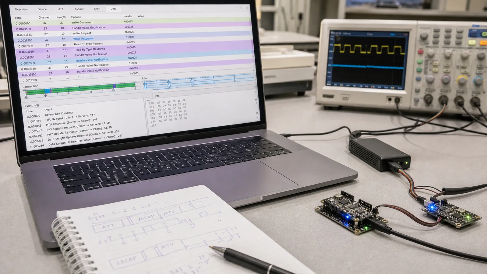

# پروتکل ATT در BLE: Attribute، Handle، Read، Write و MTU

Attribute و Handle را درک کنید، Read و Write و Error Response را بشناسید و اثر MTU را با تحلیل پکت ATT در Wireshark ببینید.

- دسته‌بندی: آموزش جامع BLE
- آخرین بروزرسانی: 2026-07-15T07:39:42.245194
- نسخه اصلی در سایت: [https://lcenj.ir/learning/10/ble-att-protocol-handle-mtu](https://lcenj.ir/learning/10/ble-att-protocol-handle-mtu)

## متن مقاله

مرحله 8 از ۲۰ مسیر تسلط بر BLE

ATT زبان پایه دسترسی به داده در BLE است. سرور یک جدول مرتب از Attributeها دارد و کلاینت با Handle آن‌ها را می‌خواند یا می‌نویسد. GATT ظاهر سطح بالاتر همین جدول است.

در پایان این مقاله چه یاد می‌گیرید؟- BLE ATT

- ATT Handle

- BLE MTU

- ATT Read Write

Attribute و Handle

هر Attribute یک Handle یکتا در همان اتصال، یک Type یا UUID، سطح دسترسی و Value دارد. Handle عددی 16 بیتی است و جای Attribute را در جدول مشخص می‌کند. Handle بین نسخه‌های Firmware تضمین ثابت ندارد؛ کلاینت حرفه‌ای سرویس را Discover می‌کند و عدد را حدس نمی‌زند.

Read و Write

Read Request یک Handle را می‌فرستد و سرور Read Response برمی‌گرداند. Write Request پاسخ موفقیت یا خطا دارد، اما Write Command یا Write Without Response برای سرعت بیشتر پاسخ ATT نمی‌خواهد. انتخاب عملیات باید بر اساس اهمیت تأیید، نرخ داده و تحمل از دست‌رفتن باشد.

Error Response

اگر Handle وجود نداشته باشد، مجوز کافی نباشد یا طول نامعتبر باشد، سرور Error Response شامل Opcode درخواست، Handle و Error Code می‌فرستد. ثبت این سه مقدار معمولاً سریع‌تر از حدس‌زدن علت خطا است. خطای امنیتی را با Pairing اشتباه نگیرید؛ ممکن است Characteristic به Encryption نیاز داشته باشد.

MTU و تکه‌تکه‌شدن

ATT MTU بیشترین اندازه PDU در ATT است. مقدار پیش‌فرض کوچک است و دو طرف می‌توانند مقدار بزرگ‌تر را مذاکره کنند. Payload مفید هر عملیات چند بایت کمتر از MTU است، چون Opcode و Handle نیز فضا می‌گیرند. افزایش MTU بدون Data Length و بافر کافی همیشه Throughput را بالا نمی‌برد.

تمرین با Sniffer

یک Read ساده در ابزار موبایل انجام دهید. در Capture ابتدا ATT Read Request را پیدا کنید، Handle را یادداشت کنید و سپس Read Response را باز کنید. بعد MTU Exchange را پیدا و اندازه توافق‌شده را با طول واقعی بسته‌ها مقایسه کنید.

چک‌لیست یادگیری

- مفهوم را با زبان خودتان توضیح دهید.

- مثال مقاله را روی کاغذ یا برد واقعی تکرار کنید.

- نتیجه، خطا و سؤال خود را یادداشت کنید.

- پس از اطمینان، به مرحله بعد بروید.

ادامه مسیر BLE

مرحله 7: معماری پروتکل BLE: از PHY و Link Layer تا L2CAP، ATT و GATTمرحله 9: GATT در BLE: طراحی Service، Characteristic، Descriptor و Notify

منابع رسمی برای مطالعه بیشتر

- راهنمای رسمی Bluetooth LE

- Bluetooth Core Specification

- راهنمای رسمی Wireshark

## فایل‌ها

نسخه HTML، CSS، تصاویر، رسانه‌ها و بسته اصلی مقاله در همین پوشه قرار گرفته‌اند.
