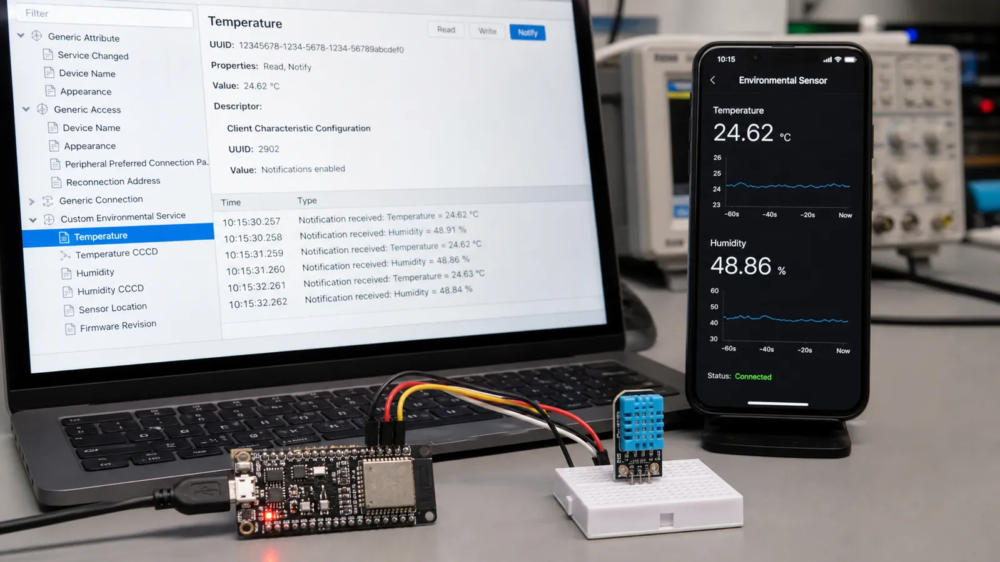

# GATT در BLE: طراحی Service، Characteristic، Descriptor و Notify

ساختار GATT را از Service تا Characteristic و Descriptor یاد بگیرید و تفاوت Read، Write، Notify و Indicate را در یک سنسور واقعی ببینید.

- دسته‌بندی: آموزش جامع BLE
- آخرین بروزرسانی: 2026-07-18T05:29:24.126824
- نسخه اصلی در سایت: [https://lcenj.ir/learning/11/ble-gatt-service-characteristic-notify](https://lcenj.ir/learning/11/ble-gatt-service-characteristic-notify)

## متن مقاله

مرحله 9 از ۲۰ مسیر تسلط بر BLE

GATT داده محصول را به ساختاری قابل کشف تبدیل می‌کند. به‌جای ارسال بایت‌های بی‌نام، مشخص می‌کنیم این سرویس محیطی است، این Characteristic دماست و این Descriptor روش فعال‌کردن اعلان را کنترل می‌کند.

در پایان این مقاله چه یاد می‌گیرید؟- BLE GATT

- GATT Service

- BLE Notify

- CCCD

Service و Characteristic

Service مجموعه‌ای منطقی از قابلیت‌های مرتبط است و می‌تواند Primary یا Secondary باشد. Characteristic شامل Declaration، Value و احتمالاً Descriptorهاست. Properties می‌گوید چه عملیاتی مجاز است؛ Permission تعیین می‌کند چه سطح دسترسی یا امنیتی لازم است.

Descriptor و CCCD

Descriptor اطلاعات تکمیلی Characteristic را نگه می‌دارد. CCCD با UUID استاندارد 0x2902 به کلاینت اجازه می‌دهد Notify یا Indicate را روشن کند. فقط داشتن Property کافی نیست؛ کلاینت باید CCCD را بنویسد و سرور وضعیت آن را برای هر اتصال نگه دارد.

Read، Write و Write Without Response

Read برای داده‌ای مناسب است که کلاینت هر زمان خواست دریافت کند. Write Request تأیید پروتکلی دارد. Write Without Response برای جریان سریع فرمان‌ها مفید است اما برنامه باید ازدحام بافر و از دست‌رفتن احتمالی را مدیریت کند. برای تنظیم مهم، پاسخ یا تأیید کاربردی طراحی کنید.

Notify در برابر Indicate

Notify پاسخ ATT ندارد و سریع‌تر است، اما تحویل در سطح ATT تضمین نمی‌شود. Indicate تا دریافت Confirmation اجازه ارسال Indication بعدی را نمی‌دهد و مطمئن‌تر ولی کندتر است. وضعیت لحظه‌ای سنسور معمولاً Notify و رخداد حیاتی یا تغییر تنظیمات می‌تواند Indicate باشد.

مدل GATT دماسنج

یک Environmental Service بسازید و دو Characteristic برای دما و رطوبت قرار دهید. هر دو Read و Notify داشته باشند. داده را با واحد ثابت مثلاً صدم درجه در int16 بفرستید و قرارداد Endianness را مستند کنید. Characteristic سوم را برای Interval نمونه‌برداری با Read و Write در نظر بگیرید.

چک‌لیست یادگیری

- مفهوم را با زبان خودتان توضیح دهید.

- مثال مقاله را روی کاغذ یا برد واقعی تکرار کنید.

- نتیجه، خطا و سؤال خود را یادداشت کنید.

- پس از اطمینان، به مرحله بعد بروید.

ادامه مسیر BLE

مرحله 8: پروتکل ATT در BLE: Attribute، Handle، Read، Write و MTUمرحله 10: UUID در BLE: تفاوت UUID16، UUID32 و UUID128 و طراحی سرویس اختصاصی

منابع رسمی برای مطالعه بیشتر

- راهنمای رسمی Bluetooth LE

- Bluetooth Core Specification

- مستندات رسمی BLE در ESP-IDF

## فایل‌ها

نسخه HTML، CSS، تصاویر، رسانه‌ها و بسته اصلی مقاله در همین پوشه قرار گرفته‌اند.
