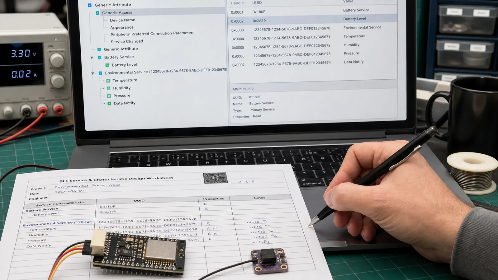

# UUID در BLE: تفاوت UUID16، UUID32 و UUID128 و طراحی سرویس اختصاصی

UUIDهای استاندارد و اختصاصی را بشناسید، سرویس‌های Battery و Device Information را استفاده کنید و برای محصول خود UUID128 منظم طراحی کنید.

- دسته‌بندی: آموزش جامع BLE
- آخرین بروزرسانی: 2026-07-24T14:21:58.258857
- نسخه اصلی در سایت: [https://lcenj.ir/learning/12/ble-uuid-standard-custom-service](https://lcenj.ir/learning/12/ble-uuid-standard-custom-service)

## متن مقاله

مرحله 10 از ۲۰ مسیر تسلط بر BLE

UUID هویت نوع Service، Characteristic یا Descriptor است. UUID کوتاه استاندارد را Bluetooth SIG تخصیص می‌دهد و برای قابلیت اختصاصی محصول باید از UUID128 تولیدشده و مستند استفاده کنید.

در پایان این مقاله چه یاد می‌گیرید؟- BLE UUID

- UUID128

- Battery Service UUID

- Custom GATT Service

UUID16، UUID32 و UUID128

UUID16 در Base UUID بلوتوث جای می‌گیرد و برای انواع استاندارد کم‌حجم است. UUID32 کمتر رایج است. UUID128 فضای بزرگی برای شناسه اختصاصی فراهم می‌کند. نمایش متنی UUID با ترتیب بایت روی هوا یکی نیست؛ هنگام Capture به Endianness دقت کنید.

سرویس‌های استاندارد

Battery Service، Device Information، Heart Rate و Environmental Sensing قراردادهای تعریف‌شده دارند و باعث سازگاری بهتر با ابزارها می‌شوند. اگر نیاز شما با استاندارد منطبق است همان را استفاده کنید و نوع داده، واحد و بازه را مطابق مشخصات پیاده‌سازی کنید.

چه زمانی سرویس اختصاصی بسازیم؟

اگر داده یا عملیات محصول در سرویس استاندارد جا نمی‌گیرد، یک UUID128 تصادفی برای Service و UUIDهای مجزا برای Characteristicها بسازید. UUID را از نام محصول یا عددهای قابل حدس نسازید. جدول UUID، Property، Permission، قالب Value و نسخه پروتکل را در مستند پروژه نگه دارید.

نسخه‌پذیری قرارداد

تغییر طول یا معنی Value می‌تواند برنامه قدیمی را خراب کند. یک Characteristic نسخه پروتکل یا فیلد Version در Payload قرار دهید. برای تغییر ناسازگار، UUID جدید یا نسخه Major جدید تعریف کنید و مدت مشخصی از نسخه قبلی پشتیبانی کنید.

طرح UUID برای سنسور محیطی

یک UUID128 برای Service بسازید. سپس UUIDهای جدا برای Temperature، Humidity، Sample Interval و Protocol Version تولید کنید. در جدول طراحی مشخص کنید دما int16 با مقیاس 0.01 درجه و ترتیب Little Endian است. این جدول مرجع Firmware و اپلیکیشن خواهد بود.

چک‌لیست یادگیری

- مفهوم را با زبان خودتان توضیح دهید.

- مثال مقاله را روی کاغذ یا برد واقعی تکرار کنید.

- نتیجه، خطا و سؤال خود را یادداشت کنید.

- پس از اطمینان، به مرحله بعد بروید.

ادامه مسیر BLE

مرحله 9: GATT در BLE: طراحی Service، Characteristic، Descriptor و Notifyمرحله 11: امنیت BLE: Pairing، Bonding، Encryption و حریم خصوصی آدرس

منابع رسمی برای مطالعه بیشتر

- راهنمای رسمی Bluetooth LE

- Bluetooth Core Specification

## فایل‌ها

نسخه HTML، CSS، تصاویر، رسانه‌ها و بسته اصلی مقاله در همین پوشه قرار گرفته‌اند.
