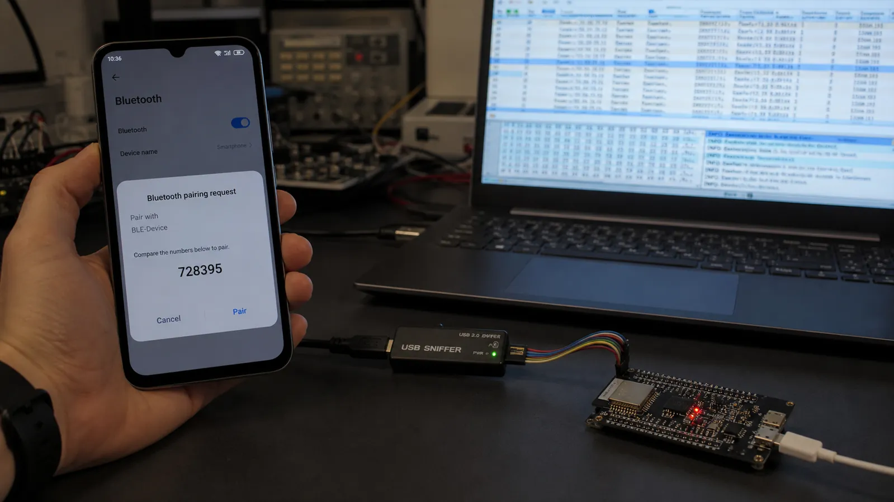

# امنیت BLE: Pairing، Bonding، Encryption و حریم خصوصی آدرس

روش‌های Pairing، تفاوت Bonding و Encryption، کلیدهای LTK و IRK و انتخاب Just Works، Passkey یا Numeric Comparison را یاد بگیرید.

- دسته‌بندی: آموزش جامع BLE
- آخرین بروزرسانی: 2026-07-18T02:28:29.346088
- نسخه اصلی در سایت: [https://lcenj.ir/learning/13/ble-security-pairing-bonding-encryption](https://lcenj.ir/learning/13/ble-security-pairing-bonding-encryption)

## متن مقاله

مرحله 11 از ۲۰ مسیر تسلط بر BLE

روشن‌کردن Pairing به‌تنهایی محصول را امن نمی‌کند. امنیت از تحلیل تهدید، قابلیت ورودی و خروجی دو دستگاه، سطح دسترسی Characteristicها، نگهداری کلید و سیاست بازیابی محصول ساخته می‌شود.

در پایان این مقاله چه یاد می‌گیرید؟- BLE security

- BLE pairing

- BLE bonding

- LTK IRK

Pairing، Bonding و Encryption

Pairing فرایند ساخت یا توافق مواد کلیدی است. Encryption با همان کلیدها لینک را محرمانه می‌کند. Bonding یعنی کلیدها برای اتصال‌های آینده ذخیره شوند. ممکن است اتصال رمز شود ولی Bond باقی نماند، یا دستگاه Bond شده باشد و در اتصال فعلی هنوز Encryption فعال نشده باشد.

روش‌های Pairing

Just Works تعامل کمی دارد اما در برابر حمله مرد میانی احراز هویت قوی نمی‌دهد. Passkey Entry به نمایشگر یا ورودی عدد نیاز دارد. Numeric Comparison در LE Secure Connections عدد مشترک را روی دو دستگاه نشان می‌دهد. OOB داده امنیتی را از کانال دیگری مثل NFC منتقل می‌کند. قابلیت IO و مدل تهدید روش مناسب را تعیین می‌کنند.

کلیدها

LTK برای رمزنگاری لینک، IRK برای شناسایی Resolvable Private Address و CSRK برای امضای داده در سناریوهای مرتبط استفاده می‌شود. کلید باید در حافظه مناسب، با کنترل دسترسی و چرخه حذف روشن نگهداری شود. Factory Reset باید Bondها را طبق انتظار کاربر پاک کند.

حریم خصوصی آدرس

آدرس ثابت دستگاه ردیابی طولانی‌مدت را آسان می‌کند. Resolvable Private Address به‌طور دوره‌ای تغییر می‌کند و دستگاه Bond شده با IRK می‌تواند آن را Resolve کند. Random Address ناشناس به معنی امن‌بودن داده نیست؛ حریم خصوصی آدرس و Encryption دو مسئله جدا هستند.

انتخاب امنیت برای قفل هوشمند

برای قفل، Just Works کافی نیست. Numeric Comparison یا OOB را در نظر بگیرید، دستورات بازکردن را فقط روی لینک رمز و احرازشده مجاز کنید، تلاش ناموفق را محدود کنید و Bond حذف‌شده را از هر دو سمت پاک کنید. سپس سناریوی گوشی گم‌شده را هم طراحی کنید.

چک‌لیست یادگیری

- مفهوم را با زبان خودتان توضیح دهید.

- مثال مقاله را روی کاغذ یا برد واقعی تکرار کنید.

- نتیجه، خطا و سؤال خود را یادداشت کنید.

- پس از اطمینان، به مرحله بعد بروید.

ادامه مسیر BLE

مرحله 10: UUID در BLE: تفاوت UUID16، UUID32 و UUID128 و طراحی سرویس اختصاصیمرحله 12: BLE در ESP32: انتخاب NimBLE، ساخت Peripheral و Central و ارسال Notify

منابع رسمی برای مطالعه بیشتر

- راهنمای رسمی Bluetooth LE

- Bluetooth Core Specification

- مستندات رسمی BLE در ESP-IDF

- مستندات رسمی STM32WB

## فایل‌ها

نسخه HTML، CSS، تصاویر، رسانه‌ها و بسته اصلی مقاله در همین پوشه قرار گرفته‌اند.
