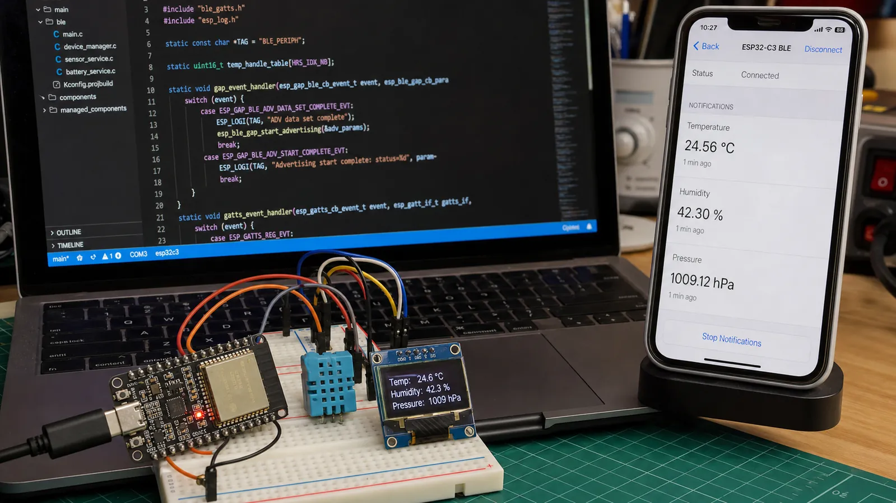

# BLE در ESP32: انتخاب NimBLE، ساخت Peripheral و Central و ارسال Notify

پشته NimBLE و Bluedroid را مقایسه کنید و در ESP32 اسکن، اتصال، GATT Server، Read، Write، Notify و مدیریت توان را پیاده کنید.

- دسته‌بندی: آموزش جامع BLE
- آخرین بروزرسانی: 2026-07-15T07:39:59.441513
- نسخه اصلی در سایت: [https://lcenj.ir/learning/14/esp32-ble-nimble-peripheral-central](https://lcenj.ir/learning/14/esp32-ble-nimble-peripheral-central)

## متن مقاله

مرحله 12 از ۲۰ مسیر تسلط بر BLE

خانواده ESP32 راه سریعی برای تبدیل مفاهیم BLE به پروژه واقعی است. ESP-IDF دو Host Stack اصلی ارائه می‌دهد: Bluedroid برای Classic و LE و NimBLE به‌عنوان گزینه سبک‌تر مخصوص LE. انتخاب را بر اساس قابلیت و حافظه انجام دهید.

در پایان این مقاله چه یاد می‌گیرید؟- ESP32 BLE

- ESP32 NimBLE

- ESP32 GATT Server

- ESP32 BLE Notify

Bluedroid یا NimBLE؟

اگر Bluetooth Classic و LE را هم‌زمان نیاز دارید، Bluedroid مسیر طبیعی است. برای محصول فقط BLE، NimBLE معمولاً RAM و Flash کمتری می‌خواهد و API مشخصی برای GAP و GATT دارد. پیش از کپی مثال قدیمی، نسخه ESP-IDF و مستند همان نسخه را بررسی کنید.

ساخت Peripheral

کنترلر و Host را راه‌اندازی کنید، GAP callback یا event handler را ثبت کنید، Service و Characteristic بسازید و Advertising را پس از آماده‌شدن GATT شروع کنید. رخداد اتصال، قطع، تغییر MTU و نوشتن CCCD را ثبت کنید. بعد از قطع، Advertising را طبق سیاست محصول دوباره آغاز کنید.

ساخت Central

Central اسکن را با فیلتر UUID یا Manufacturer Data محدود می‌کند، دستگاه را متصل می‌کند، سرویس و Characteristic را Discover می‌کند و در صورت نیاز CCCD را می‌نویسد. آدرس تصادفی و تغییر آدرس باعث می‌شود تکیه بر رشته آدرس برای شناسایی محصول همیشه درست نباشد.

Notify و چند اتصال

قبل از Notify بررسی کنید کلاینت آن را فعال کرده و اتصال هنوز معتبر است. برای چند اتصال، وضعیت CCCD، Handle اتصال، MTU و صف ارسال را جدا نگه دارید. در محصول باتری‌خور، Advertising Interval، Connection Parameter، Light Sleep و زمان نمونه‌برداری را با هم تنظیم و اندازه‌گیری کنید.

منطق ساده دماسنج ESP32-C3

هر یک ثانیه SHT31 را بخوانید، دما را به int16 با مقیاس صدم درجه تبدیل کنید و فقط اگر مقدار تغییر معنادار داشت Notify بفرستید. Characteristic تنظیم Interval را Writeable کنید و مقدار را در NVS ذخیره کنید. خطاهای I2C و قطع اتصال نباید حلقه اصلی را متوقف کنند.

چک‌لیست یادگیری

- مفهوم را با زبان خودتان توضیح دهید.

- مثال مقاله را روی کاغذ یا برد واقعی تکرار کنید.

- نتیجه، خطا و سؤال خود را یادداشت کنید.

- پس از اطمینان، به مرحله بعد بروید.

ادامه مسیر BLE

مرحله 11: امنیت BLE: Pairing، Bonding، Encryption و حریم خصوصی آدرسمرحله 13: BLE در STM32WB: راه‌اندازی CubeMX، ساخت Service و Low Power

منابع رسمی برای مطالعه بیشتر

- مستندات رسمی BLE در ESP-IDF

- راهنمای رسمی Bluetooth LE

## فایل‌ها

نسخه HTML، CSS، تصاویر، رسانه‌ها و بسته اصلی مقاله در همین پوشه قرار گرفته‌اند.
