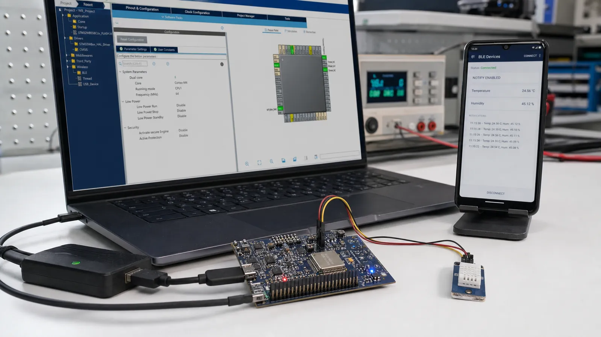

# BLE در STM32WB: راه‌اندازی CubeMX، ساخت Service و Low Power

معماری دو هسته‌ای STM32WB، تنظیم CubeMX، ساخت Service و Characteristic، ارسال Notify، مدیریت اتصال و حالت کم‌مصرف را بیاموزید.

- دسته‌بندی: آموزش جامع BLE
- آخرین بروزرسانی: 2026-07-24T14:21:50.676508
- نسخه اصلی در سایت: [https://lcenj.ir/learning/15/stm32wb-ble-cubemx-service-notify](https://lcenj.ir/learning/15/stm32wb-ble-cubemx-service-notify)

## متن مقاله

مرحله 13 از ۲۰ مسیر تسلط بر BLE

STM32WB اجرای برنامه و بخش بی‌سیم را میان هسته کاربردی و هسته شبکه تقسیم می‌کند. این معماری زمان‌بندی رادیو را از برنامه اصلی جدا می‌کند، اما نسخه Wireless Stack، FUS و پکیج Cube باید سازگار باشند.

در پایان این مقاله چه یاد می‌گیرید؟- STM32WB BLE

- CubeMX BLE

- STM32WB GATT

- STM32WB Notify

معماری STM32WB

برنامه کاربر معمولاً روی Cortex-M4 اجرا می‌شود و هسته شبکه وظایف رادیویی را انجام می‌دهد. ارتباط بین دو بخش از سازوکارهای بین‌پردازنده‌ای عبور می‌کند. بنابراین خرابی Stack یا ناسازگاری Firmware می‌تواند حتی با کد کاربردی سالم مانع Advertising شود.

پیکربندی CubeMX

برد و پکیج Firmware درست را انتخاب کنید، BLE و سرویس‌های موردنیاز را فعال کنید، Clock و RF را طبق برد مرجع تنظیم کنید و کد تولیدشده را در ناحیه‌های USER CODE توسعه دهید. فایل Release Notes پکیج را برای نسخه Stack و محدودیت‌ها بخوانید.

Service و Notify

در ابزار پیکربندی، UUID، اندازه Value، Property و Permission را تعریف کنید. هنگام تغییر سنسور، Value را در Attribute Database به‌روزرسانی و در صورت فعال‌بودن Notification آن را ارسال کنید. رخداد Write از کلاینت را اعتبارسنجی کنید و طول ورودی را هرگز فرض نگیرید.

مدیریت اتصال و Low Power

رخدادهای اتصال، قطع و Pairing را به State Machine برنامه تبدیل کنید. پیش از ورود به Stop Mode مطمئن شوید Scheduler و Stack بی‌سیم اجازه خواب می‌دهند. مصرف را روی برد نهایی اندازه بگیرید، چون LED دیباگ و Debugger می‌توانند نتیجه را تغییر دهند.

پروژه شروع STM32WB

یک Service محیطی با Characteristic دما بسازید. تایمر برنامه هر ثانیه سنسور را می‌خواند و فقط در صورت تغییر بیش از 0.1 درجه Value را به‌روزرسانی می‌کند. پس از اطمینان از Notify، Tick و Log اضافی را کم و مصرف Stop Mode را اندازه بگیرید.

چک‌لیست یادگیری

- مفهوم را با زبان خودتان توضیح دهید.

- مثال مقاله را روی کاغذ یا برد واقعی تکرار کنید.

- نتیجه، خطا و سؤال خود را یادداشت کنید.

- پس از اطمینان، به مرحله بعد بروید.

ادامه مسیر BLE

مرحله 12: BLE در ESP32: انتخاب NimBLE، ساخت Peripheral و Central و ارسال Notifyمرحله 14: ابزارهای تحلیل BLE: nRF Connect، Sniffer و Wireshark از صفر

منابع رسمی برای مطالعه بیشتر

- مستندات رسمی STM32WB

- راهنمای رسمی Bluetooth LE

## فایل‌ها

نسخه HTML، CSS، تصاویر، رسانه‌ها و بسته اصلی مقاله در همین پوشه قرار گرفته‌اند.
