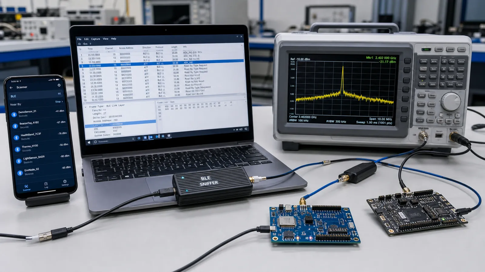

# ابزارهای تحلیل BLE: nRF Connect، Sniffer و Wireshark از صفر

با nRF Connect دستگاه را اسکن و GATT را آزمایش کنید، Capture بگیرید، پکت‌ها را در Wireshark فیلتر کنید و RSSI و Throughput را بسنجید.

- دسته‌بندی: آموزش جامع BLE
- آخرین بروزرسانی: 2026-07-15T07:40:00.061269
- نسخه اصلی در سایت: [https://lcenj.ir/learning/16/ble-debug-tools-nrf-connect-wireshark](https://lcenj.ir/learning/16/ble-debug-tools-nrf-connect-wireshark)

## متن مقاله

مرحله 14 از ۲۰ مسیر تسلط بر BLE

دیباگ BLE بدون مشاهده شواهد معمولاً به حدس تبدیل می‌شود. ابزار موبایل وضعیت GATT را نشان می‌دهد، Sniffer پکت روی هوا را می‌گیرد و Wireshark لایه‌ها را Decode می‌کند. ابزار RF حرفه‌ای برای مشکلات پایین‌تر از پروتکل به کار می‌آید.

در پایان این مقاله چه یاد می‌گیرید؟- nRF Connect BLE

- BLE Sniffer

- Wireshark BLE

- تحلیل پکت BLE

nRF Connect

با Scanner نام، آدرس، RSSI و AD Structure را ببینید. پس از اتصال، Serviceها را Discover کنید، Value را Read و Write کنید و CCCD را برای Notify فعال کنید. Log رخدادها را ذخیره کنید تا زمان قطع، MTU و خطای Permission مشخص باشد.

Sniffer و Capture

Sniffer باید کانال Advertising دستگاه هدف را پیدا کند و در زمان اتصال پارامترهای لازم برای دنبال‌کردن Channel Hopping را بگیرد. Capture ناقص ممکن است به‌خاطر شروع دیرهنگام، فاصله زیاد، تداخل یا رمزنگاری باشد. Sniffer را نزدیک دستگاه‌ها ولی با سطح سیگنال اشباع‌نشده قرار دهید.

Wireshark

فیلتر نمایش را مرحله‌ای بسازید: ابتدا دستگاه، سپس پروتکل ATT یا SMP و بعد Opcode موردنظر. ستون‌های Handle، Length و Time Delta را اضافه کنید. دنبال اولین خطا بگردید؛ خطاهای بعدی ممکن است فقط نتیجه همان رخداد اول باشند.

RSSI و Throughput

RSSI برآوردی از توان دریافتی است و فاصله‌سنج دقیق نیست. آن را در چند موقعیت و جهت‌گیری ثبت کنید. Throughput را با شمارش بایت کاربردی در بازه زمان اندازه بگیرید، نه سرعت PHY. Retransmission، MTU، Interval و محدودیت موبایل را در گزارش بنویسید.

روال دیباگ قطع اتصال

زمان دقیق قطع را ثبت کنید، Capture را از قبل آغاز کنید، آخرین Connection Event و Reason را پیدا کنید و RSSI را کنار آن بنویسید. سپس فقط یک متغیر مثل فاصله، Interval یا Timeout را تغییر دهید. تغییر هم‌زمان چند عامل نتیجه را غیرقابل تفسیر می‌کند.

چک‌لیست یادگیری

- مفهوم را با زبان خودتان توضیح دهید.

- مثال مقاله را روی کاغذ یا برد واقعی تکرار کنید.

- نتیجه، خطا و سؤال خود را یادداشت کنید.

- پس از اطمینان، به مرحله بعد بروید.

ادامه مسیر BLE

مرحله 13: BLE در STM32WB: راه‌اندازی CubeMX، ساخت Service و Low Powerمرحله 15: بهینه‌سازی BLE: افزایش Throughput و کاهش Latency و مصرف باتری

منابع رسمی برای مطالعه بیشتر

- ابزارهای رسمی nRF Connect

- راهنمای رسمی Wireshark

- راهنمای رسمی Bluetooth LE

## فایل‌ها

نسخه HTML، CSS، تصاویر، رسانه‌ها و بسته اصلی مقاله در همین پوشه قرار گرفته‌اند.
