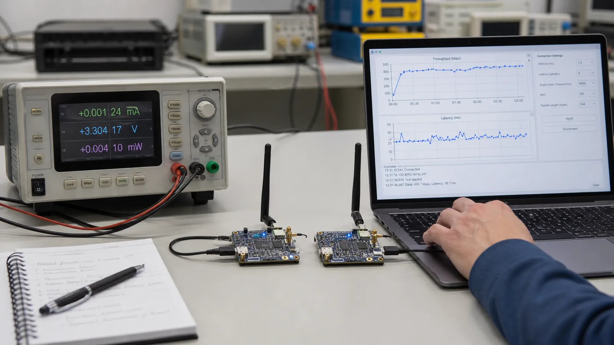

# بهینه‌سازی BLE: افزایش Throughput و کاهش Latency و مصرف باتری

MTU، Data Length، PHY و Connection Parameter را هماهنگ تنظیم کنید و میان سرعت، تأخیر، پایداری و انرژی تعادل قابل اندازه‌گیری بسازید.

- دسته‌بندی: آموزش جامع BLE
- آخرین بروزرسانی: 2026-07-18T01:29:18.780578
- نسخه اصلی در سایت: [https://lcenj.ir/learning/17/ble-performance-throughput-latency-power](https://lcenj.ir/learning/17/ble-performance-throughput-latency-power)

## متن مقاله

مرحله 15 از ۲۰ مسیر تسلط بر BLE

بهینه‌سازی BLE یک دکمه جادویی ندارد. بزرگ‌کردن MTU، رفتن به 2M یا کوتاه‌کردن Interval تنها وقتی مفید است که بافر، Data Length، کیفیت لینک و توان پردازش هر دو طرف هماهنگ باشند.

در پایان این مقاله چه یاد می‌گیرید؟- BLE throughput

- BLE latency

- BLE MTU optimization

- BLE power optimization

MTU و Data Length

MTU بزرگ‌تر تعداد سربار ATT را برای داده حجیم کم می‌کند. Data Length Extension اجازه می‌دهد Payload بیشتری در یک پکت Link Layer جا شود. اگر یکی بزرگ و دیگری کوچک بماند، L2CAP داده را قطعه‌قطعه می‌کند و سود محدود می‌شود. اندازه‌های واقعی مذاکره‌شده را از Capture بخوانید.

PHY Update

2M زمان روی هوا را کم می‌کند و در لینک قوی می‌تواند سرعت و انرژی هر بایت را بهتر کند. Coded PHY برای برد و حساسیت است، نه سرعت. تصمیم PHY را با Packet Error Rate و Retransmission بسنجید؛ سرعت اسمی بالا در لینک ضعیف ممکن است نتیجه بدتری بدهد.

Connection Parameters

Interval کوتاه فرصت ارسال بیشتری می‌دهد و Latency فرمان را کم می‌کند، اما بیداری رادیو زیاد می‌شود. Peripheral Latency برای سنسور کم‌ترافیک مفید است. تعداد پکت قابل ارسال در هر Event نیز به کنترلر و سیستم‌عامل Central وابسته است.

روش اندازه‌گیری

یک Payload و مدت تست ثابت تعریف کنید. بایت کاربردی موفق، تأخیر صدکی، جریان متوسط، Peak Current، RSSI و تعداد Retransmission را ثبت کنید. هر بار فقط یک پارامتر را عوض کنید و برای شرایط نزدیک، دور و همراه Wi-Fi آزمایش تکرار کنید.

دو پروفایل عملی

پروفایل تعاملی: Interval کوتاه، Latency صفر و در صورت لینک مناسب 2M. پروفایل سنسور باتری‌خور: Interval بلندتر، Latency مجاز و Notify فقط هنگام تغییر. دستگاه می‌تواند بعد از پایان تنظیمات از پروفایل تعاملی به پروفایل کم‌مصرف منتقل شود.

چک‌لیست یادگیری

- مفهوم را با زبان خودتان توضیح دهید.

- مثال مقاله را روی کاغذ یا برد واقعی تکرار کنید.

- نتیجه، خطا و سؤال خود را یادداشت کنید.

- پس از اطمینان، به مرحله بعد بروید.

ادامه مسیر BLE

مرحله 14: ابزارهای تحلیل BLE: nRF Connect، Sniffer و Wireshark از صفرمرحله 16: پروژه‌های عملی BLE برای شروع: LED، دماسنج، باتری و Beacon

منابع رسمی برای مطالعه بیشتر

- راهنمای رسمی Bluetooth LE

- Bluetooth Core Specification

- مستندات رسمی BLE در ESP-IDF

## فایل‌ها

نسخه HTML، CSS، تصاویر، رسانه‌ها و بسته اصلی مقاله در همین پوشه قرار گرفته‌اند.
