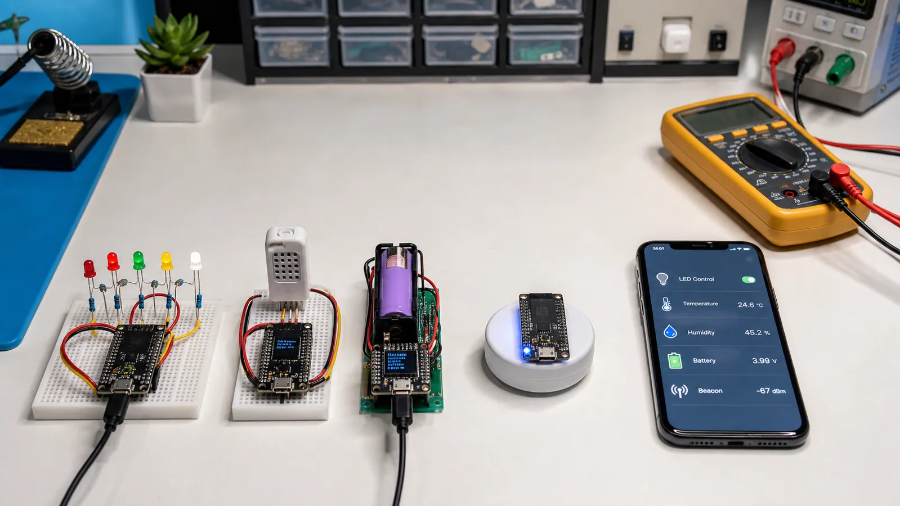

# پروژه‌های عملی BLE برای شروع: LED، دماسنج، باتری و Beacon

شش پروژه ساده BLE را با ESP32 شروع کنید: کنترل LED، دماسنج، مانیتور باتری، رطوبت‌سنج، Beacon و ارسال داده به موبایل.

- دسته‌بندی: آموزش جامع BLE
- آخرین بروزرسانی: 2026-07-18T02:20:21.569211
- نسخه اصلی در سایت: [https://lcenj.ir/learning/18/ble-beginner-projects-esp32](https://lcenj.ir/learning/18/ble-beginner-projects-esp32)

## متن مقاله

مرحله 16 از ۲۰ مسیر تسلط بر BLE

در پروژه‌های پایه هدف ساخت محصول کامل نیست؛ هدف این است که حلقه «سخت‌افزار، GATT، موبایل و دیباگ» را چند بار با پیچیدگی کنترل‌شده طی کنید. هر پروژه باید یک خروجی قابل مشاهده و یک معیار موفقیت روشن داشته باشد.

در پایان این مقاله چه یاد می‌گیرید؟- پروژه BLE

- دماسنج BLE ESP32

- ESP32 BLE LED

- BLE beacon project

کنترل LED

یک Characteristic با Write بسازید و مقدار صفر یا یک را به GPIO تبدیل کنید. طول ورودی و مقدار مجاز را بررسی کنید. وضعیت واقعی LED را با Read یا Notify برگردانید تا برنامه موبایل فقط به فرمان ارسالی اعتماد نکند.

دماسنج و رطوبت‌سنج

SHT31 را با I2C بخوانید، خطا و CRC سنسور را بررسی و داده را به عدد صحیح مقیاس‌دار تبدیل کنید. دو Characteristic یا یک Payload نسخه‌دار بسازید. Notify را فقط پس از فعال‌کردن CCCD و با نرخ منطقی بفرستید.

باتری مانیتور

ولتاژ باتری را با تقسیم مقاومتی و ADC بخوانید و کالیبراسیون کنید. درصد باتری فقط تبدیل خطی ولتاژ نیست و به شیمی سلول و بار وابسته است. برای شروع Battery Service استاندارد با Level تقریبی کافی است؛ محدودیت تخمین را در UI بنویسید.

Beacon و موبایل

یک Advertising غیرقابل اتصال با شناسه و داده کوتاه بسازید. Interval و TX Power را تغییر دهید و اثر آن را روی RSSI و زمان کشف ثبت کنید. سپس با ابزار موبایل Service و Characteristic پروژه‌های متصل را بدون نوشتن اپ اختصاصی آزمایش کنید.

ترتیب پیشنهادی اجرا

ابتدا LED را برای یادگیری Write بسازید. سپس دماسنج را برای Read و Notify اضافه کنید. بعد Battery Service و در پایان Beacon بدون اتصال را آزمایش کنید. برای هر پروژه Capture کوتاه و جدول خطا نگه دارید تا دانش مرحله‌های قبل تثبیت شود.

چک‌لیست یادگیری

- مفهوم را با زبان خودتان توضیح دهید.

- مثال مقاله را روی کاغذ یا برد واقعی تکرار کنید.

- نتیجه، خطا و سؤال خود را یادداشت کنید.

- پس از اطمینان، به مرحله بعد بروید.

ادامه مسیر BLE

مرحله 15: بهینه‌سازی BLE: افزایش Throughput و کاهش Latency و مصرف باتریمرحله 17: پروژه‌های متوسط BLE: تنظیم Wi-Fi، ارتباط دو ESP32 و اپ موبایل

منابع رسمی برای مطالعه بیشتر

- مستندات رسمی BLE در ESP-IDF

- راهنمای رسمی Bluetooth LE

## فایل‌ها

نسخه HTML، CSS، تصاویر، رسانه‌ها و بسته اصلی مقاله در همین پوشه قرار گرفته‌اند.
