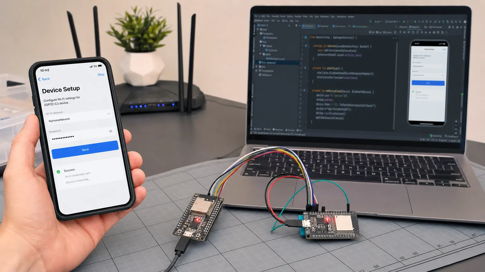

# پروژه‌های متوسط BLE: تنظیم Wi-Fi، ارتباط دو ESP32 و اپ موبایل

با BLE اطلاعات Wi-Fi را تنظیم کنید، دو ESP32 را متصل کنید، اپ اندروید بسازید، تنظیمات را ذخیره و قطع و وصل را مدیریت کنید.

- دسته‌بندی: آموزش جامع BLE
- آخرین بروزرسانی: 2026-07-18T02:08:47.806364
- نسخه اصلی در سایت: [https://lcenj.ir/learning/19/ble-intermediate-projects-wifi-provisioning](https://lcenj.ir/learning/19/ble-intermediate-projects-wifi-provisioning)

## متن مقاله

مرحله 17 از ۲۰ مسیر تسلط بر BLE

در سطح متوسط، مشکل اصلی دیگر ارسال یک عدد نیست؛ باید وضعیت، خطا، ذخیره‌سازی و تجربه کاربر را مدیریت کنید. دستگاه ممکن است وسط تنظیم Wi-Fi خاموش شود، موبایل مجوز اسکن ندهد یا اتصال در نیمه کار قطع شود.

در پایان این مقاله چه یاد می‌گیرید؟- BLE WiFi provisioning

- ارتباط دو ESP32 BLE

- اپلیکیشن اندروید BLE

- BLE reconnect

تنظیم Wi-Fi از طریق BLE

دستگاه در حالت Setup یک Service امن ارائه می‌دهد. موبایل SSID و Credential را در قطعه‌های کنترل‌شده می‌فرستد، دستگاه قالب را اعتبارسنجی و در حافظه امن ذخیره می‌کند و نتیجه اتصال را Notify می‌کند. داده حساس را در Advertising یا Log چاپ نکنید.

ارتباط دو ESP32

یک برد Peripheral سنسور و برد دیگر Central یا Gateway باشد. Central با UUID فیلتر کند، Discover انجام دهد و پس از قطع با Backoff دوباره تلاش کند. State Machine را از Task سنسور جدا کنید تا ناپایداری لینک کل برنامه را متوقف نکند.

اپلیکیشن موبایل

اپ باید مجوزهای نسخه سیستم‌عامل، Scan timeout، فیلتر دستگاه، نمایش وضعیت اتصال و Unsubscribe را مدیریت کند. عملیات GATT را صف‌بندی کنید؛ اجرای هم‌زمان چند Read و Write در بسیاری از APIهای موبایل نتیجه قابل اعتماد ندارد.

ذخیره تنظیمات و Reconnect

تنظیمات را با Version و CRC ذخیره کنید و مقدار نامعتبر را به پیش‌فرض برگردانید. Reconnect بی‌نهایت و سریع باتری را خالی می‌کند. Backoff، سقف تلاش و گزینه ورود دوباره به Setup Mode تعریف کنید.

پروتکل ساده Provisioning

چهار Characteristic برای Command، SSID، Credential و Status در نظر بگیرید. موبایل ابتدا Session امن می‌سازد، فیلدها را می‌نویسد و فرمان Connect می‌دهد. دستگاه وضعیت‌های validating، connecting، success یا error-code را Notify می‌کند. بعد از موفقیت سرویس Setup را محدود کنید.

چک‌لیست یادگیری

- مفهوم را با زبان خودتان توضیح دهید.

- مثال مقاله را روی کاغذ یا برد واقعی تکرار کنید.

- نتیجه، خطا و سؤال خود را یادداشت کنید.

- پس از اطمینان، به مرحله بعد بروید.

ادامه مسیر BLE

مرحله 16: پروژه‌های عملی BLE برای شروع: LED، دماسنج، باتری و Beaconمرحله 18: پروژه‌های پیشرفته BLE: OTA، Mesh، Long Range و پروتکل اختصاصی

منابع رسمی برای مطالعه بیشتر

- مستندات رسمی BLE در ESP-IDF

- راهنمای رسمی Bluetooth LE

## فایل‌ها

نسخه HTML، CSS، تصاویر، رسانه‌ها و بسته اصلی مقاله در همین پوشه قرار گرفته‌اند.
