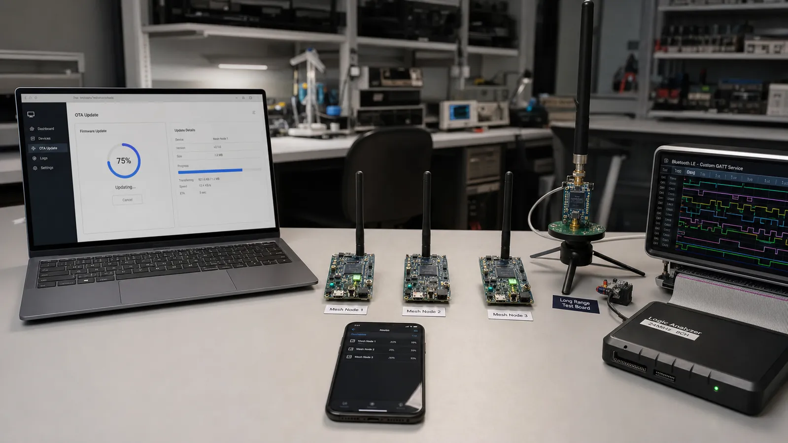

# پروژه‌های پیشرفته BLE: OTA، Mesh، Long Range و پروتکل اختصاصی

DFU و OTA امن، BLE Mesh، Long Range، Streaming، پروتکل اختصاصی روی GATT و چند اتصال را با نگاه معماری بررسی کنید.

- دسته‌بندی: آموزش جامع BLE
- آخرین بروزرسانی: 2026-07-18T08:01:06.059903
- نسخه اصلی در سایت: [https://lcenj.ir/learning/20/ble-advanced-projects-ota-mesh-long-range](https://lcenj.ir/learning/20/ble-advanced-projects-ota-mesh-long-range)

## متن مقاله

مرحله 18 از ۲۰ مسیر تسلط بر BLE

در پروژه پیشرفته، هر قابلیت باید در برابر قطع برق، افت لینک، نسخه قدیمی، حمله و کمبود حافظه مقاوم باشد. نمونه آزمایشگاهی موفق هنوز محصول قابل انتشار نیست؛ مسیر Recovery و مشاهده‌پذیری بخشی از طراحی است.

در پایان این مقاله چه یاد می‌گیرید؟- BLE OTA

- BLE Mesh

- BLE Long Range

- BLE streaming

DFU و OTA

Firmware باید امضا و نسخه آن بررسی شود. داده در قطعه‌ها منتقل، صحت هر بخش کنترل و تصویر در پارتیشن غیرفعال نوشته می‌شود. Bootloader فقط تصویر معتبر را فعال کند و در شکست راه بازگشت داشته باشد. قطع ارتباط در 90 درصد نباید دستگاه را بلااستفاده کند.

Mesh و Long Range

BLE Mesh روی Advertising و مدل Publish/Subscribe شبکه چندگرهی می‌سازد و با اتصال عادی GATT یکی نیست. LE Coded PHY برد لینک نقطه‌به‌نقطه را در شرایط مناسب افزایش می‌دهد. Mesh، Relay و برد زیاد هزینه زمان روی هوا و انرژی دارند و باید با توپولوژی واقعی تست شوند.

Streaming و پروتکل اختصاصی

برای جریان داده، Header شامل Version، Type، Sequence، Length و Checksum تعریف کنید. Flow Control و اندازه صف را مشخص کنید و Receiver اجازه توقف یا کاهش نرخ داشته باشد. فقط به Write Without Response متکی نباشید؛ بافر کنترلر نامحدود نیست.

چند Central و Peripheral

هر اتصال Context، بافر، CCCD و پارامتر مستقل دارد. Scheduler رادیو باید Eventهای همه لینک‌ها را جا دهد. با افزایش اتصال، Interval، Throughput و مصرف تغییر می‌کند. سقف عملی را با بار واقعی پیدا کنید، نه فقط عدد Datasheet.

طرح فریم داده اختصاصی

بایت اول Version، بایت دوم Message Type، دو بایت Sequence، دو بایت Length، سپس Payload و CRC قرار دهید. گیرنده ابتدا Length را با MTU و بافر مقایسه کند، Sequence تکراری را رد کند و برای فرمان مهم ACK کاربردی بفرستد.

چک‌لیست یادگیری

- مفهوم را با زبان خودتان توضیح دهید.

- مثال مقاله را روی کاغذ یا برد واقعی تکرار کنید.

- نتیجه، خطا و سؤال خود را یادداشت کنید.

- پس از اطمینان، به مرحله بعد بروید.

ادامه مسیر BLE

مرحله 17: پروژه‌های متوسط BLE: تنظیم Wi-Fi، ارتباط دو ESP32 و اپ موبایلمرحله 19: BLE صنعتی: Mesh، تأییدیه محصول، تست RF، آنتن و Matching

منابع رسمی برای مطالعه بیشتر

- راهنمای رسمی Bluetooth LE

- Bluetooth Core Specification

- مستندات رسمی BLE در ESP-IDF

- مستندات رسمی STM32WB

## فایل‌ها

نسخه HTML، CSS، تصاویر، رسانه‌ها و بسته اصلی مقاله در همین پوشه قرار گرفته‌اند.
