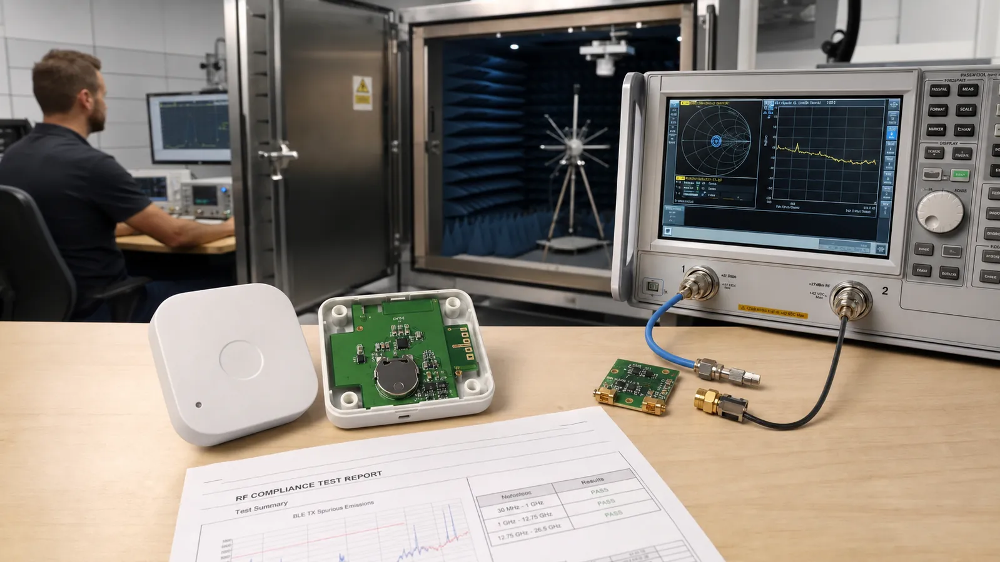

# BLE صنعتی: Mesh، تأییدیه محصول، تست RF، آنتن و Matching

از Provisioning و Friend Node تا Qualification، CE و FCC، تست RF، طراحی آنتن، Matching Network و کالیبراسیون RSSI را برای محصول تجاری بشناسید.

- دسته‌بندی: آموزش جامع BLE
- آخرین بروزرسانی: 2026-07-15T07:40:00.047914
- نسخه اصلی در سایت: [https://lcenj.ir/learning/21/industrial-ble-rf-antenna-certification](https://lcenj.ir/learning/21/industrial-ble-rf-antenna-certification)

## متن مقاله

مرحله 19 از ۲۰ مسیر تسلط بر BLE

محصول صنعتی فقط Firmware کارکرده نیست. آنتن باید داخل قاب و کنار باتری تست شود، مسیر حقوقی استفاده از Bluetooth بررسی شود و محصول مقررات رادیویی بازار هدف را بگذراند. این برنامه باید پیش از PCB نهایی وارد زمان‌بندی شود.

در پایان این مقاله چه یاد می‌گیرید؟- BLE certification

- طراحی آنتن BLE

- BLE RF test

- BLE Mesh industrial

Mesh صنعتی

Provisioning هویت و کلیدهای شبکه را وارد می‌کند. Relay پیام را بازپخش، Proxy ارتباط با GATT Client را ممکن و Friend برای Low Power Node پیام نگه می‌دارد. فعال‌کردن همه قابلیت‌ها روی همه Nodeها ازدحام و مصرف می‌سازد؛ نقش هر گره را از توپولوژی انتخاب کنید.

Qualification و مقررات

استفاده از طراحی مرجع یا ماژول تأییدشده مسیر را ساده می‌کند اما مسئولیت محصول نهایی را حذف نمی‌کند. Bluetooth Qualification با الزامات رادیویی CE، FCC یا بازارهای دیگر یکسان نیست. پیش از تولید، آزمایشگاه و مشاور مقرراتی بازار هدف را درگیر کنید.

طراحی آنتن و Matching

ناحیه Keepout آنتن باید از مس، باتری، کابل و قاب نامناسب دور بماند. مسیر RF کوتاه و کنترل‌شده باشد. شبکه Matching جای اصلاح تصادفی نیست؛ با VNA و Fixture مناسب، S11 و امپدانس را روی محصول مونتاژشده و داخل قاب اندازه بگیرید.

تست RF و RSSI

توان خروجی، حساسیت، خطای فرکانس و نشر ناخواسته در شرایط تعریف‌شده اندازه‌گیری می‌شود. RSSI هر تراشه و برد Offset دارد؛ برای کاربرد نسبی می‌توان با مرجع و چند سطح سیگنال کالیبره کرد. RSSI را به فاصله دقیق تبدیل نکنید مگر مدل محیطی و عدم قطعیت را پذیرفته باشید.

چک‌لیست پیش از PCB نهایی

ماژول یا SoC، آنتن، Stack و مسیر Qualification را مشخص کنید؛ Keepout و Connector تست RF بگذارید؛ نمونه را داخل قاب با باتری نهایی اندازه بگیرید؛ Pre-scan EMC و تست Range انجام دهید؛ سپس فایل تولید و برنامه تست کارخانه را قفل کنید.

چک‌لیست یادگیری

- مفهوم را با زبان خودتان توضیح دهید.

- مثال مقاله را روی کاغذ یا برد واقعی تکرار کنید.

- نتیجه، خطا و سؤال خود را یادداشت کنید.

- پس از اطمینان، به مرحله بعد بروید.

ادامه مسیر BLE

مرحله 18: پروژه‌های پیشرفته BLE: OTA، Mesh، Long Range و پروتکل اختصاصیمرحله 20: تسلط نهایی بر BLE: مسیر ساخت یک محصول تجاری از ایده تا تست

منابع رسمی برای مطالعه بیشتر

- راهنمای رسمی Bluetooth LE

- Bluetooth Core Specification

- مستندات رسمی STM32WB

## فایل‌ها

نسخه HTML، CSS، تصاویر، رسانه‌ها و بسته اصلی مقاله در همین پوشه قرار گرفته‌اند.
