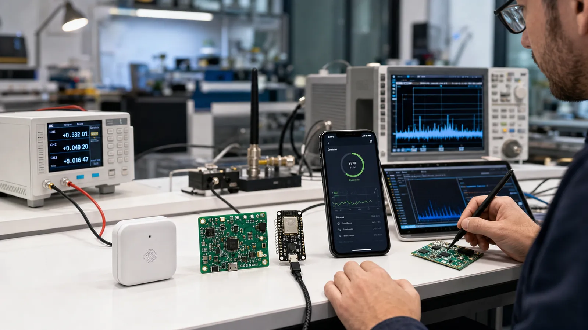

# تسلط نهایی بر BLE: مسیر ساخت یک محصول تجاری از ایده تا تست

دانش Advertising، GATT، امنیت، تحلیل پکت، بهینه‌سازی انرژی، اپ موبایل و RF را در یک پروژه نهایی محصول‌محور کنار هم قرار دهید.

- دسته‌بندی: آموزش جامع BLE
- آخرین بروزرسانی: 2026-07-15T07:40:00.142306
- نسخه اصلی در سایت: [https://lcenj.ir/learning/22/ble-mastery-commercial-product-roadmap](https://lcenj.ir/learning/22/ble-mastery-commercial-product-roadmap)

## متن مقاله

مرحله 20 از ۲۰ مسیر تسلط بر BLE

تسلط یعنی بتوانید رفتار سیستم را پیش‌بینی، اندازه‌گیری و در زمان خطا توضیح دهید. پروژه نهایی باید از یک نیاز واقعی شروع شود و سخت‌افزار، Firmware، پروتکل، اپلیکیشن، امنیت، انرژی و تولید را به یک قرارداد منسجم تبدیل کند.

در پایان این مقاله چه یاد می‌گیرید؟- نقشه راه BLE

- تسلط بر BLE

- محصول تجاری BLE

- آموزش کامل Bluetooth Low Energy

مهارت‌هایی که باید اثبات کنید

یک Advertising Packet را دستی و با ابزار تحلیل کنید؛ GATT یک دستگاه ناشناخته را بخوانید؛ Service اختصاصی با قرارداد نسخه‌دار طراحی کنید؛ Pairing و Permission را از مدل تهدید انتخاب کنید؛ و با Capture علت خطای ارتباط را پیدا کنید.

پروژه نهایی پیشنهادی

یک سنسور باتری‌خور بسازید که داده محیطی را نمایش می‌دهد، از طریق BLE تنظیم می‌شود، داده را Notify می‌کند و Battery Service دارد. اپ موبایل کشف، اتصال، نمودار و تنظیم را انجام دهد. Firmware به‌روزرسانی امن و مسیر Recovery داشته باشد.

معیارهای پذیرش

برد و Packet Error Rate در چند محیط، زمان اتصال، تأخیر فرمان، Throughput، جریان متوسط و عمر برآوردی باتری، رفتار قطع و وصل، تست امنیتی و موفقیت OTA را با عدد تعریف کنید. عبارت «خوب کار می‌کند» معیار مهندسی نیست.

از نمونه تا محصول

PCB و آنتن را در قاب نهایی تست کنید، BOM و جایگزین قطعه داشته باشید، Fixture برنامه‌ریزی و تست کارخانه بسازید، Log نسخه و شناسه تولید را ثبت کنید و مسیر پشتیبانی و Rollback را طراحی کنید. مستند پروتکل باید میان Firmware، اپ و تست مشترک باشد.

برنامه اجرای چهار هفته‌ای

هفته اول معماری و GATT، هفته دوم Prototype و اپ ابزار، هفته سوم اندازه‌گیری انرژی و خطایابی RF، هفته چهارم امنیت، OTA و تست پذیرش. در پایان Demo، Capture، گزارش توان، سورس نسخه‌گذاری‌شده و فهرست ریسک‌ها را ارائه کنید.

چک‌لیست یادگیری

- مفهوم را با زبان خودتان توضیح دهید.

- مثال مقاله را روی کاغذ یا برد واقعی تکرار کنید.

- نتیجه، خطا و سؤال خود را یادداشت کنید.

- پس از اطمینان، به مرحله بعد بروید.

ادامه مسیر BLE

مرحله 19: BLE صنعتی: Mesh، تأییدیه محصول، تست RF، آنتن و Matching

منابع رسمی برای مطالعه بیشتر

- راهنمای رسمی Bluetooth LE

- Bluetooth Core Specification

- مستندات رسمی BLE در ESP-IDF

- مستندات رسمی STM32WB

- راهنمای رسمی Wireshark

## فایل‌ها

نسخه HTML، CSS، تصاویر، رسانه‌ها و بسته اصلی مقاله در همین پوشه قرار گرفته‌اند.
