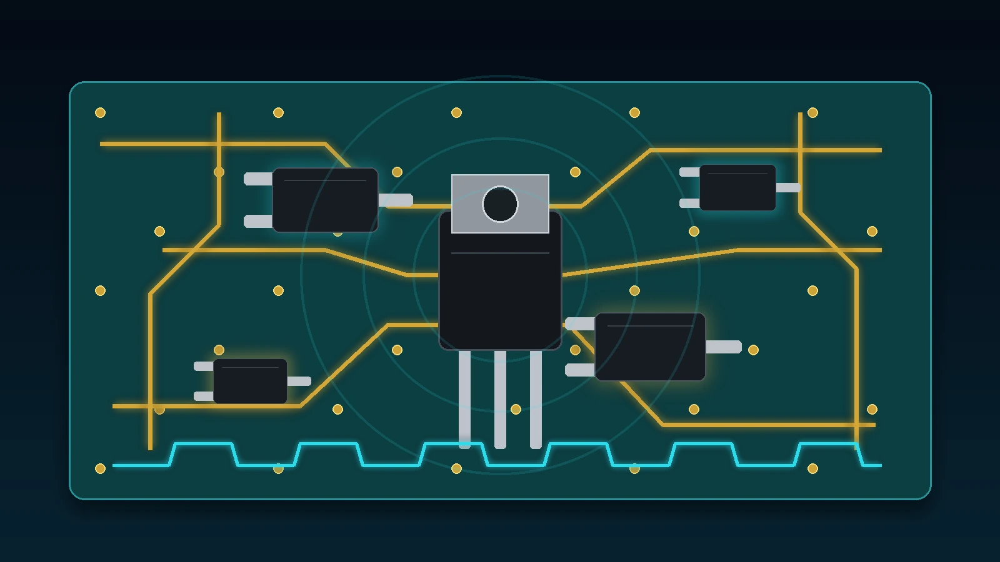

# آموزش MOSFET با مثال عملی؛ NMOS و PMOS

در این آموزش، MOSFET را به‌صورت کاملاً عملی و مسئله‌محور یاد می‌گیریم. از روشن‌کردن یک LED با NMOS شروع می‌کنیم، پارامترهای مهم دیتاشیت را در عمل بررسی می‌کنیم و در ادامه تفاوت PMOS و NMOS و کاربرد هرکدام را با مثال واقعی یاد می‌گیریم.

- دسته‌بندی: مبانی امبدد
- آخرین بروزرسانی: 2026-07-27T11:39:50.942321
- نسخه اصلی در سایت: [https://lcenj.ir/learning/23/آموزش-mosfet-با-مثال-عملی؛-nmos-و-pmos](https://lcenj.ir/learning/23/آموزش-mosfet-با-مثال-عملی؛-nmos-و-pmos)

## متن مقاله

آموزش مسئله‌محور الکترونیک کاربردی

ماسفت را با ساختن دو مدار واقعی یاد بگیریم؛ کنترل بار ۱۲ ولت با NMOS و قطع تغذیه با PMOS

این درس از تعریف‌های طولانی شروع نمی‌شود. ابتدا با یک مسئله کوچک روبه‌رو می‌شویم:

چطور یک بار ۱۲ ولت را با خروجی ۳٫۳ ولتی ESP32 روشن، خاموش و کم‌وزیاد کنیم؟

در مسیر حل همین مسئله، پایه‌های ماسفت، VGS، مقاومت روشن، گرما، PWM و خواندن دیتاشیت را یاد می‌گیریم.

بعد یک مسئله جدید ایجاد می‌کنیم تا دلیل استفاده از PMOS را عملاً ببینیم.

دو مدار واقعی

دو دیتاشیت واقعی

کد ESP-IDF

اندازه‌گیری با مولتی‌متر

نقطه شروع

مسئله شماره ۱: یک نوار LED دوازده ولت داریم، اما ESP32 فقط فرمان منطقی می‌دهد

فرض کنید یک نوار LED یا یک بار ۱۲ ولت با جریان حدود ۱ آمپر داریم. می‌خواهیم آن را با GPIO18 روشن و خاموش کنیم.

نخستین فکر ممکن است این باشد که بار را مستقیم به پایه ESP32 وصل کنیم؛ اما GPIO برای انتقال توان ساخته نشده است.

پایه میکروکنترلر فقط باید فرمان بدهد و مسیر اصلی جریان بار باید از قطعه دیگری عبور کند.

اتصال اشتباه

بار ۱۲ ولت و پرجریان مستقیماً به GPIO وصل شود.

نتیجه احتمالی: آسیب GPIO یا کل برد.

اتصال درست

GPIO فقط کلید الکترونیکی را کنترل کند و جریان بار از منبع ۱۲ ولت عبور کند.

قطعه‌ای که اینجا نیاز داریم: MOSFET.

فعلاً فقط این تصویر ذهنی را نگه دارید

ماسفت را مثل یک کلید سه‌پایه در نظر بگیرید. یک پایه فرمان می‌گیرد و دو پایه دیگر مسیر عبور جریان بار را می‌سازند.

جزئیات را زمانی توضیح می‌دهیم که در مدار به آن‌ها نیاز پیدا کنیم.

آزمایش اول

مدار NMOS را ببندیم و قبل از هر تئوری، روشن و خاموش شدن بار را ببینیم

AO3400A در مسیر منفی بار قرار گرفته است؛ این آرایش را Low-side می‌نامیم.

قطعات مورد نیاز

- ESP32 یا ESP32-S3

- ماسفت AO3400A روی برد تبدیل SOT-23 یا PCB آزمایش

- نوار LED دوازده ولت یا بار مقاومتی کم‌خطر

- منبع ۱۲ ولت دارای محدودکننده جریان

- مقاومت ۲۲۰ اهم برای مسیر Gate

- مقاومت ۱۰۰ کیلو اهم بین Gate و Source

- مولتی‌متر

اتصالات، قدم‌به‌قدم

- مثبت منبع ۱۲ ولت را به مثبت بار وصل کنید.

- منفی بار را به پایه Drain ماسفت وصل کنید.

- پایه Source ماسفت را به زمین منبع ۱۲ ولت وصل کنید.

- زمین ESP32 را به همان زمین منبع ۱۲ ولت وصل کنید.

- GPIO18 را از طریق مقاومت ۲۲۰ اهم به Gate وصل کنید.

- یک مقاومت ۱۰۰ کیلو اهم بین Gate و Source قرار دهید.

- محدودکننده جریان منبع را ابتدا روی مقدار پایین تنظیم کنید و سپس تغذیه را وصل کنید.

آزمایش اول را با موتور یا پمپ شروع نکنید

برای شروع از نوار LED یا بار مقاومتی استفاده کنید. بارهای القایی مانند موتور، پمپ، رله و شیر برقی هنگام قطع شدن پالس ولتاژ ایجاد می‌کنند و به دیود هرزگرد نیاز دارند.

فرمان ساده برای تست روشن و خاموش

#include "driver/gpio.h"

#include "freertos/FreeRTOS.h"

#include "freertos/task.h"

#define MOSFET_GATE GPIO_NUM_18

void app_main(void)

{

gpio_reset_pin(MOSFET_GATE);

gpio_set_direction(MOSFET_GATE, GPIO_MODE_OUTPUT);

gpio_set_level(MOSFET_GATE, 0);

while (1) {

gpio_set_level(MOSFET_GATE, 1); // بار روشن

vTaskDelay(pdMS_TO_TICKS(2000));

gpio_set_level(MOSFET_GATE, 0); // بار خاموش

vTaskDelay(pdMS_TO_TICKS(2000));

}

}

چه چیزی باید ببینیم؟

وضعیت GPIOولتاژ تقریبی Gate نسبت به Sourceرفتار ماسفتوضعیت بار

صفرتقریباً ۰ ولتخاموشخاموش

یکتقریباً ۳٫۳ ولتروشنروشن

حالا مفهوم را از روی مدار استخراج کنیم

Gate، Drain، Source و VGS دقیقاً در همین مدار چه معنی دارند؟

Gate

پایه فرمان است و از GPIO سیگنال می‌گیرد. در حالت ثابت تقریباً جریان DC قابل توجهی مصرف نمی‌کند، اما هنگام تغییر وضعیت باید شارژ و تخلیه شود.

Drain

در این مدار به منفی بار متصل شده است. هنگامی که ماسفت روشن می‌شود، جریان بار از Drain به Source عبور می‌کند.

Source

در مدار Low-side به زمین وصل است و مرجع واقعی ولتاژ Gate محسوب می‌شود.

مهم‌ترین نکته درس

ماسفت با ولتاژ Gate نسبت به Source کنترل می‌شود. این ولتاژ را VGS می‌نامیم.

در مدار ما Source روی زمین است؛ بنابراین Gate برابر ۳٫۳ ولت یعنی VGS تقریباً ۳٫۳ ولت.

چرا مقاومت ۱۰۰ کیلو اهم گذاشتیم؟

هنگام روشن شدن یا Reset شدن ESP32، پایه GPIO ممکن است برای چند لحظه ورودی و بدون وضعیت مشخص باشد.

Gate ماسفت مثل یک خازن کوچک می‌تواند شارژ باقی‌مانده نگه دارد. مقاومت ۱۰۰ کیلو اهم Gate را به Source می‌کشد تا ماسفت به صورت پیش‌فرض خاموش بماند.

چرا مقاومت ۲۲۰ اهم سری Gate گذاشتیم؟

هنگام تغییر وضعیت، GPIO باید ظرفیت Gate را شارژ یا تخلیه کند. مقاومت سری جریان لحظه‌ای را محدود می‌کند و به کاهش نوسان و نویز کمک می‌کند.

برای این آزمایش ۲۲۰ اهم مقدار مناسبی است، اما در PWM سریع مقدار دقیق باید با بار Gate، فرکانس و سرعت مورد نیاز بررسی شود.

دیتاشیت را فقط برای تصمیم‌های واقعی بخوانیم

چرا AO3400A برای این مثال انتخاب شده است؟

ما قرار نیست تمام دیتاشیت را حفظ کنیم. فقط سؤال‌هایی را می‌پرسیم که برای مدار ۱۲ ولت و GPIO سه‌ولت‌وسه لازم است.

۱. آیا ولتاژ ۱۲ ولت را تحمل می‌کند؟

در دیتاشیت مقدار VDS برابر ۳۰ ولت است. بنابراین از نظر ولتاژ اسمی برای مدار ۱۲ ولت مناسب است؛ با این حال در بار القایی باید پالس‌های ولتاژ مهار شوند.

۲. آیا با Gate سه‌ولت‌وسه واقعاً روشن می‌شود؟

دیتاشیت مقاومت روشن RDS(on) را در VGS برابر ۲٫۵ ولت نیز مشخص کرده است: حداکثر حدود ۴۸ میلی‌اهم.

این موضوع بسیار مهم‌تر از VGS(th) است، چون VGS(th) فقط شروع هدایت با جریان بسیار کم را نشان می‌دهد.

۳. آیا جریان ۱ آمپر باعث داغ شدن می‌شود؟

با استفاده از بدترین مقدار ۴۸ میلی‌اهم، تلفات هدایتی را حساب می‌کنیم.

P = I² × R

P = 1² × 0.048

P = 0.048 W

حدود ۴۸ میلی‌وات تلفات برای شروع کم است. اما در ۲ آمپر، تلفات چهار برابر می‌شود:

P = 2² × 0.048 = 0.192 W

۴. پس عدد جریان ۵٫۷ آمپر روی صفحه اول یعنی چه؟

این عدد در شرایط حرارتی و برد مشخص اندازه‌گیری شده است. نباید نتیجه بگیریم که هر AO3400A روی هر PCB بدون بررسی دما می‌تواند دائماً ۵٫۷ آمپر عبور دهد.

سطح مس، دمای محیط، کیفیت مونتاژ و مدت زمان عبور جریان تعیین‌کننده‌اند.

۵. حداکثر ولتاژ Gate چقدر است؟

حد مطلق VGS برابر ±۱۲ ولت است. در مدار ۳٫۳ ولتی فاصله زیادی با این حد داریم.

پارامتر دیتاشیتسؤال عملی مامقدار AO3400A

VDSآیا ۱۲ ولت را تحمل می‌کند؟۳۰ ولت

RDS(on) در VGS=2.5Vبا GPIO سه‌ولت‌وسه چقدر افت و گرما داریم؟حداکثر ۴۸ میلی‌اهم

RDS(on) در VGS=4.5Vبا درایو قوی‌تر چه تغییری می‌کند؟حداکثر ۳۲ میلی‌اهم

VGS(max)Gate تا چه ولتاژی آسیب نمی‌بیند؟±۱۲ ولت

Qg در 4.5Vدر PWM شارژ Gate چقدر است؟حدود ۷ نانوکولن

RθJAبرد و دفع گرما چقدر مهم‌اند؟وابسته به PCB؛ حدود ۱۲۵ درجه بر وات در حالت پایدار مرجع

مسئله را یک مرحله سخت‌تر کنیم

به‌جای فقط روشن و خاموش کردن، شدت نور را با PWM تغییر دهیم

اکنون همان مدار را نگه می‌داریم و GPIO را با PWM کنترل می‌کنیم. ماسفت بار را با سرعت چند هزار بار در ثانیه روشن و خاموش می‌کند.

چشم انسان میانگین نور را می‌بیند؛ بنابراین با تغییر Duty Cycle، روشنایی تغییر می‌کند.

۰٪خاموش

۲۵٪نور کم

۵۰٪نور متوسط

۷۵٪نور زیاد

۱۰۰٪روشن کامل

#define PWM_FREQUENCY_HZ 5000

#define PWM_MAX_DUTY 1023

static void pwm_set_percent(uint32_t percent)

{

if (percent > 100) {

percent = 100;

}

uint32_t duty = (PWM_MAX_DUTY * percent) / 100;

ledc_set_duty(LEDC_LOW_SPEED_MODE, LEDC_CHANNEL_0, duty);

ledc_update_duty(LEDC_LOW_SPEED_MODE, LEDC_CHANNEL_0);

}

اینجا کدام پارامتر جدید دیتاشیت مهم می‌شود؟

در روشن و خاموش شدن آهسته، ظرفیت Gate تقریباً مسئله بزرگی نبود. در PWM، پارامتر Qg یا Gate Charge اهمیت پیدا می‌کند.

هرچه Qg بیشتر باشد، GPIO یا درایور باید بار بیشتری را در هر سیکل جابه‌جا کند و زمان عبور ماسفت از ناحیه نیمه‌روشن بیشتر می‌شود.

آزمایش اندازه‌گیری

در Dutyهای ۲۵، ۵۰، ۷۵ و ۱۰۰ درصد، جریان ورودی و دمای ماسفت را ثبت کنید. فایل ثبت اندازه‌گیری داخل بسته دانلود قرار دارد.

یک خطای واقعی در پروژه‌ها

اگر بار ما پمپ، موتور، رله یا شیر برقی باشد چه چیزی تغییر می‌کند؟

بار القایی هنگام عبور جریان انرژی ذخیره می‌کند. وقتی ماسفت ناگهان خاموش می‌شود، این انرژی تلاش می‌کند جریان را ادامه دهد و می‌تواند ولتاژ Drain را شدیداً بالا ببرد.

به همین دلیل یک دیود هرزگرد موازی بار قرار می‌دهیم.

جهت دیود هرزگرد

در حالت عادی دیود باید معکوس باشد؛ یعنی کاتد به مثبت منبع و آند به سمت Drain یا منفی بار متصل شود.

دیود باید از نظر جریان، سرعت و انرژی با بار انتخاب شود.

اینجا متوجه می‌شویم که VDS برابر ۳۰ ولت به تنهایی تضمین کافی نیست. برای بار ۱۲ ولت القایی، دیود، TVS، مسیرهای کوتاه و بررسی شکل موج با اسیلوسکوپ اهمیت دارند.

مسئله شماره ۲

گاهی نمی‌خواهیم زمین بار را قطع کنیم؛ باید مثبت تغذیه را قطع کنیم

فرض کنید یک سنسور یا ماژول ۵ ولتی به ESP32 وصل است و خطوط داده آن باید زمین مشترک داشته باشند.

اگر تغذیه را از سمت زمین با NMOS قطع کنیم، مسیرهای سیگنال ممکن است ماژول را به شکل ناخواسته از طریق پایه‌های داده تغذیه کنند.

راه بهتر این است که مثبت ۵ ولت را قطع کنیم. اینجا PMOS وارد می‌شود.

AO3401A مثبت تغذیه را قطع می‌کند و زمین بار همواره مشترک باقی می‌ماند.

چرا Gate را مستقیماً به ESP32 وصل نکردیم؟

Source ماسفت روی ۵ ولت است. برای خاموش شدن PMOS، Gate باید تقریباً به همان ۵ ولت برسد؛ اما GPIO ESP32 حداکثر ۳٫۳ ولت خروجی می‌دهد.

اگر Gate مستقیم به GPIO وصل شود، در حالت High نیز VGS برابر ۳٫۳ منهای ۵، یعنی حدود منفی ۱٫۷ ولت می‌شود و ممکن است ماسفت کاملاً خاموش نشود.

بنابراین یک ترانزیستور NPN کوچک Gate را پایین می‌کشد و مقاومت Pull-up آن را هنگام خاموشی به Source برمی‌گرداند.

اتصالات قدم‌به‌قدم

- Source ماسفت AO3401A را به مثبت ۵ ولت وصل کنید.

- Drain را به مثبت بار وصل کنید.

- منفی بار و زمین ESP32 را مشترک کنید.

- یک مقاومت ۱۰۰ کیلو اهم بین Gate و Source قرار دهید تا PMOS پیش‌فرض خاموش باشد.

- Gate را از طریق مقاومت ۱ کیلو اهم به کلکتور NPN وصل کنید.

- امیتر NPN را به زمین وصل کنید.

- GPIO19 را از طریق مقاومت ۴٫۷ کیلو اهم به بیس NPN وصل کنید.

GPIO = 0NPN خاموشGate ≈ SourceVGS ≈ 0PMOS خاموش

GPIO = 1NPN روشنGate ≈ 0VVGS ≈ −5VPMOS روشن

static void load_power_set(bool enabled)

{

// در این مدار GPIO=1 باعث روشن شدن NPN و سپس PMOS می‌شود.

gpio_set_level(GPIO_NUM_19, enabled ? 1 : 0);

}

دیتاشیت دوم، فقط برای همین مدار

AO3401A را با سؤال‌های عملی بررسی کنیم

سؤالپارامترپاسخ دیتاشیت AO3401A

آیا ریل ۵ ولت را تحمل می‌کند؟VDSمنفی ۳۰ ولت

در VGS حدود منفی ۵ ولت چقدر مقاومت دارد؟RDS(on) در −4.5Vحداکثر حدود ۶۰ میلی‌اهم

در ریل کم‌ولتاژ هم قابل استفاده است؟RDS(on) در −2.5Vحداکثر حدود ۸۵ میلی‌اهم

حد آسیب Gate چیست؟VGS(max)±۱۲ ولت

برای سوئیچینگ Gate چقدر بار دارد؟Qg در 4.5Vحدود ۷ نانوکولن

محاسبه تلفات برای بار ۸۰۰ میلی‌آمپر

P = I² × R

P = 0.8² × 0.060

P ≈ 0.038 W

همین مدار را بدون تغییر روی ۱۲ ولت تکرار نکنید

اگر Source روی ۱۲ ولت باشد و NPN Gate را تا صفر پایین بکشد، VGS تقریباً منفی ۱۲ ولت می‌شود؛ یعنی دقیقاً روی حد مطلق دیتاشیت.

در محصول واقعی باید کلمپ زنر، شبکه محدودکننده یا درایور High-side مناسب در نظر گرفته شود.

جمع‌بندی بر اساس کاربرد

چه زمانی NMOS و چه زمانی PMOS انتخاب کنیم؟

نیاز مدارانتخاب معمولدلیل

کنترل موتور، LED، رله یا پمپ از سمت زمینNMOS Low-sideدرایو ساده با GPIO و مقاومت روشن معمولاً کمتر

PWM سریع و پرتلفات پایینNMOSمعمولاً انتخاب‌های بهتر و RDS(on) پایین‌تر دارد

قطع مثبت تغذیه یک ماژولPMOS High-sideزمین بار مشترک می‌ماند

High-side با ولتاژ یا جریان بالا و PWM سریعNMOS همراه درایور High-sideبازده بهتر از PMOS، اما مدار پیچیده‌تر

تمرین عملی

این درس زمانی تمام می‌شود که اعداد را اندازه بگیرید

- در مدار NMOS، VGS را در حالت خاموش و روشن اندازه بگیرید.

- در حالت روشن، VDS را اندازه بگیرید و با رابطه R≈VDS/I مقاومت تقریبی مسیر را محاسبه کنید.

- جریان بار را در Dutyهای ۲۵، ۵۰، ۷۵ و ۱۰۰ درصد ثبت کنید.

- پس از پنج دقیقه کار، دمای ماسفت و دمای مس اطراف آن را بررسی کنید.

- منبع را خاموش کنید، Drain و Source را عمداً با نقشه پین‌آوت تطبیق دهید و جهت دیود بدنه را در حالت Diode Test بررسی کنید.

- مدار PMOS را اجرا و VGS را در دو حالت GPIO صفر و یک اندازه بگیرید.

- سیم مثبت بار را قطع و وصل کنید و بررسی کنید که زمین بار همچنان مشترک باقی می‌ماند.

هدف اصلی تمرین

دانشجو باید بتواند بدون حفظ‌کردن تعریف‌ها، از روی ولتاژهای اندازه‌گیری‌شده توضیح دهد چرا NMOS یا PMOS روشن و خاموش شده است.

عیب‌یابی

اگر مدار کار نکرد، از این ترتیب جلو بروید

- زمین مشترک را بررسی کنید. در مدار NMOS، زمین ESP32 و منبع بار باید مشترک باشد.

- پین‌آوت واقعی قطعه را با دیتاشیت تطبیق دهید. ترتیب پایه‌های SOT-23 را از روی ظاهر حدس نزنید.

- VGS را اندازه بگیرید، نه فقط ولتاژ Gate نسبت به زمین.

- Gate شناور نباشد. Pull-down برای NMOS و Pull-up به Source برای PMOS را بررسی کنید.

- منبع وارد محدودکننده جریان نشده باشد.

- VDS حالت روشن را اندازه بگیرید. مقدار زیاد یعنی ماسفت کامل روشن نشده، قطعه نامناسب است یا اتصال اشتباه است.

- برای بار القایی، دیود هرزگرد و جهت آن را بررسی کنید.

- در PMOS، منطق مدار را اشتباه نگیرید. پایین رفتن Gate نسبت به Source باعث روشن شدن می‌شود.

فرمول انتخاب ماسفت برای پروژه بعدی

قبل از انتخاب قطعه، فقط به این هفت سؤال پاسخ دهید:

- ولتاژ واقعی Drain-Source و پالس‌های احتمالی چقدر است؟

- جریان پیوسته و جریان لحظه شروع بار چقدر است؟

- VGS واقعی در مدار چند ولت خواهد بود؟

- RDS(on) در همان VGS چقدر است؟

- تلفات I²R و افزایش دما چقدر می‌شود؟

- فرکانس سوئیچینگ و Qg چقدر است؟

- بار مقاومتی است یا القایی و چه حفاظت‌هایی نیاز دارد؟

دانلود کدهای ESP-IDF، دیتاشیت AO3400A و AO3401A، BOM و برگه ثبت اندازه‌گیری

آنچه در این درس عملاً یاد گرفتیم

با یک مشکل کوچک شروع کردیم، AO3400A را به صورت NMOS Low-side بستیم، VGS و RDS(on) را هنگام نیاز از دیتاشیت استخراج کردیم،

PWM را اضافه کردیم، خطر بار القایی را شناختیم و سپس برای قطع مثبت تغذیه، مدار PMOS High-side با AO3401A ساختیم.

حالا پارامترهای دیتاشیت دیگر مجموعه‌ای از اعداد جدا از مدار نیستند؛ هر پارامتر پاسخ یک سؤال طراحی واقعی است.

## فایل‌ها

نسخه HTML، CSS، تصاویر، رسانه‌ها و بسته اصلی مقاله در همین پوشه قرار گرفته‌اند.
