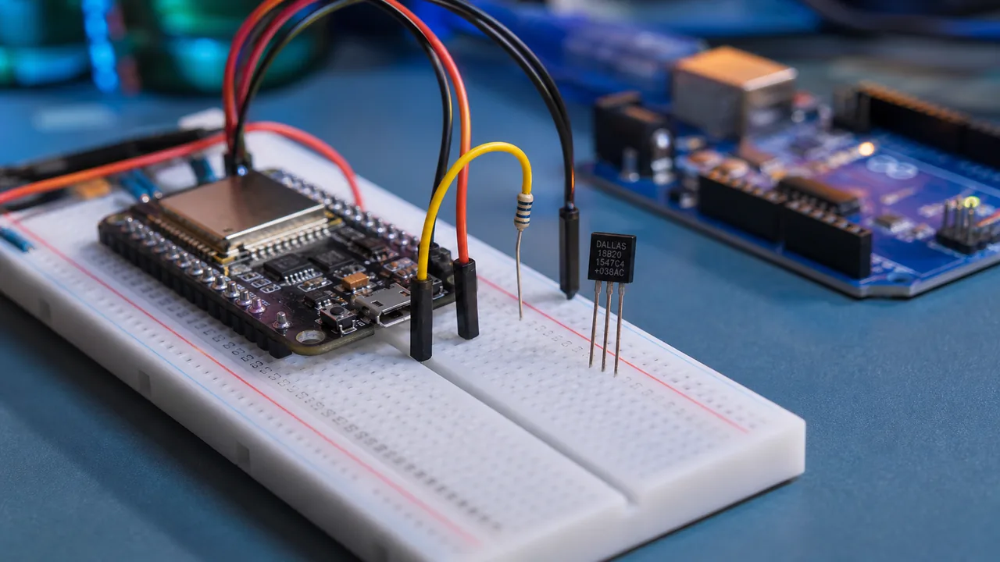

# آموزش کامل سنسور دمای DS18B20 با Arduino و ESP32

راهنمای گام‌به‌گام سیم‌کشی، تایمینگ 1-Wire، تنظیم دقت، حالت تغذیه عادی و پارازیتی و برنامه‌نویسی DS18B20 با آردوینو و ESP32 همراه با کد و دیتاشیت رسمی.

- دسته‌بندی: دما و رطوبت
- آخرین بروزرسانی: 2026-07-29T20:12:04.274759
- نسخه اصلی در سایت: [https://lcenj.ir/learning/24/ds18b20-arduino-esp32](https://lcenj.ir/learning/24/ds18b20-arduino-esp32)

## متن مقاله

آموزش سنسور دما و پروتکل 1-Wire

راه‌اندازی سنسور دمای DS18B20 با Arduino و ESP32

در این راهنمای پروژه‌محور، از شناخت پایه‌ها و سیم‌کشی صحیح تا زمان‌بندی باس 1-Wire، تنظیم تفکیک‌پذیری، خواندن چند سنسور، تغذیه عادی و تغذیه پارازیتی و برنامه‌نویسی عملی را گام‌به‌گام یاد می‌گیرید.

دانلود دیتاشیت رسمی DS18B20 از Analog Devices

دانلود کدهای Arduino و ESP32

بازه دما55- تا 125+ درجه سانتی‌گراد

دقت±0.5°C در بازه 10- تا 85+

رزولوشنقابل تنظیم از 9 تا 12 بیت

رابط1-Wire با شناسه یکتای 64 بیتی

DS18B20 چیست و چه زمانی انتخاب خوبی است؟

DS18B20 یک دماسنج دیجیتال کالیبره‌شده است که اندازه‌گیری را داخل تراشه انجام می‌دهد و نتیجه را به‌صورت دیجیتال روی باس 1-Wire می‌فرستد. برخلاف سنسورهای آنالوگ، طول سیم و نویز ADC مستقیماً عدد دما را تغییر نمی‌دهد. هر سنسور یک کد ROM یکتای 64 بیتی دارد؛ بنابراین چند DS18B20 می‌توانند تنها با یک پایه میکروکنترلر کار کنند.

نکته خرید: نمونه‌های غیراصل DS18B20 در بازار وجود دارند. اگر دقت اندازه‌گیری، کد شناسایی یکتا یا امکان استفاده از تغذیه پارازیتی برایتان مهم است، قطعه را از تأمین‌کننده معتبر تهیه کنید و عملکرد آن را در چند دمای مشخص با یک مرجع قابل اعتماد مقایسه کنید.

پایه‌ها و سیم‌کشی صحیح

در پکیج TO-92، هنگامی که سطح تخت بدنه رو به شما و پایه‌ها به سمت پایین هستند، ترتیب پایه‌ها از چپ به راست به این صورت است:

پایهنامکاربرد

1GNDزمین مدار

2DQخط داده 1-Wire؛ باید با یک مقاومت پول‌آپ مناسب به ولتاژ منطقی متصل شود

3VDDورودی تغذیه 3.0 تا 5.5 ولت؛ فقط در حالت تغذیه پارازیتی به GND متصل می‌شود

Arduino Uno

- VDD → 5V

- GND → GND

- DQ → D2

- مقاومت پول‌آپ 4.7kΩ بین DQ و 5V

ESP32

- VDD → 3.3V

- GND → GND

- DQ → GPIO4 یا یک GPIO مناسب دیگر

- مقاومت پول‌آپ 4.7kΩ بین DQ و 3.3V

توجه: دو اتصال بالا مربوط به حالت عادی و سه‌سیمه هستند. در این حالت، VDD هرگز به GND وصل نمی‌شود.

برای کابل‌های بلند یا محیط صنعتی، توپولوژی خطی، کابل زوج‌تابیده، خازن بای‌پس نزدیک سنسور و مقاومت پول‌آپ متناسب با ظرفیت باس معمولاً نتیجه بهتری از اتصال ستاره‌ای می‌دهند. مقدار 4.7 کیلو‌اهم نقطه شروع رایج است، اما مقدار نهایی باید با توجه به طول کابل، تعداد سنسورها و ظرفیت باس بررسی شود.

روش‌های تغذیه: عادی و پارازیتی

تغذیه عادی سه‌سیمه

در این روش، پایه VDD به منبع تغذیه متصل است و خط DQ فقط برای تبادل داده استفاده می‌شود. این روش برای ESP32، چند سنسور، کابل بلند و طراحی‌های قابل اعتماد پیشنهاد می‌شود.

تغذیه پارازیتی دوسیمه

در تغذیه پارازیتی، سیم مثبت جداگانه حذف می‌شود، پایه VDD طبق دیتاشیت به GND متصل می‌شود و سنسور انرژی موردنیاز خود را هنگام HIGH بودن خط DQ در خازن داخلی ذخیره می‌کند. هنگام تبدیل دما و اجرای فرمان Copy Scratchpad باید روی خط داده «پول‌آپ قوی» برقرار شود؛ مقاومت پول‌آپ معمولی به‌تنهایی همیشه جریان لازم را تأمین نمی‌کند. اگر تازه شروع کرده‌اید، از اتصال عادی سه‌سیمه استفاده کنید.

رزولوشن و زمان تبدیل دما

بیت‌های R1 و R0 در رجیستر Configuration رزولوشن را مشخص می‌کنند. دقت عددی بیشتر، زمان تبدیل طولانی‌تری می‌خواهد:

رزولوشنگام اندازه‌گیریحداکثر زمان تبدیل

9 بیت0.5°C93.75 ms

10 بیت0.25°C187.5 ms

11 بیت0.125°C375 ms

12 بیت0.0625°C750 ms

رزولوشن بالاتر به معنی دقت مطلق بهتر نیست؛ دقت تضمین‌شده در بازه اصلی ±0.5°C است. برای کنترل دمای سریع، 10 یا 11 بیت اغلب انتخاب متعادل‌تری است.

تایمینگ پروتکل 1-Wire به زبان ساده

هر تبادل با Reset شروع می‌شود. مستر باس را حداقل 480 میکروثانیه LOW می‌کند؛ سپس سنسور پس از رها شدن خط، با پالس Presence حضور خود را اعلام می‌کند. هر اسلات خواندن یا نوشتن حداقل 60 میکروثانیه است و بین اسلات‌ها حداقل 1 میکروثانیه زمان بازیابی لازم است.

ResetLOW ≥ 480µs

Presenceشروع 15–60µs، LOW به مدت 60–240µs

Write 1LOW کوتاه 1–15µs

Write 0LOW حدود 60µs

ReadLOW کوتاه؛ نمونه‌برداری تا 15µs از شروع اسلات

در برنامه‌های معمول نیازی نیست این تأخیرها را دستی بسازید؛ کتابخانه OneWire آن‌ها را مدیریت می‌کند. دانستن تایمینگ برای عیب‌یابی با لاجیک آنالایزر، کابل‌های بلند و نوشتن درایور اختصاصی ضروری است.

فرمان‌های مهم DS18B20

فرمانکدکاربرد

Search ROMF0hپیدا کردن آدرس همه سنسورها روی باس

Match ROM55hانتخاب یک سنسور با آدرس 64 بیتی

Skip ROMCChخطاب به تنها سنسور یا همه سنسورها

Convert T44hشروع تبدیل دما

Read ScratchpadBEhخواندن دما، آلارم، تنظیمات و CRC

Write Scratchpad4Ehنوشتن TH، TL و رزولوشن

Read Power SupplyB4hتشخیص تغذیه عادی یا پارازیتی

Alarm SearchEChپیدا کردن سنسورهایی که از محدوده آلارم خارج شده‌اند

راه‌اندازی با Arduino

- در Library Manager کتابخانه‌های OneWire و DallasTemperature را نصب کنید.

- سیم DQ را به پایه D2 و مقاومت 4.7kΩ را بین DQ و 5V وصل کنید.

- کد زیر را اجرا و Serial Monitor را روی 115200 تنظیم کنید.

#include <OneWire.h>

#include <DallasTemperature.h>

#define ONE_WIRE_BUS 2

OneWire oneWire(ONE_WIRE_BUS);

DallasTemperature sensors(&oneWire);

void setup() {

Serial.begin(115200);

sensors.begin();

sensors.setResolution(12);

Serial.printf("Sensors: %d\n", sensors.getDeviceCount());

}

void loop() {

sensors.requestTemperatures();

float c = sensors.getTempCByIndex(0);

if (c == DEVICE_DISCONNECTED_C) {

Serial.println("Sensor disconnected");

} else {

Serial.printf("Temperature: %.2f C\n", c);

}

delay(1000);

}

راه‌اندازی با ESP32 و خواندن غیرمسدودکننده

همان دو کتابخانه روی Arduino Core for ESP32 کار می‌کنند. DQ را به GPIO4 و Pull-up را به 3.3V وصل کنید. برای جلوگیری از توقف 750 میلی‌ثانیه‌ای برنامه، تبدیل را غیرمسدودکننده انجام دهید:

#include <OneWire.h>

#include <DallasTemperature.h>

constexpr uint8_t ONE_WIRE_BUS = 4;

OneWire oneWire(ONE_WIRE_BUS);

DallasTemperature sensors(&oneWire);

uint32_t conversionStarted = 0;

bool converting = false;

void setup() {

Serial.begin(115200);

sensors.begin();

sensors.setResolution(12);

sensors.setWaitForConversion(false);

}

void loop() {

if (!converting) {

sensors.requestTemperatures();

conversionStarted = millis();

converting = true;

}

if (converting && millis() - conversionStarted >= 750) {

float c = sensors.getTempCByIndex(0);

Serial.printf("Temperature: %.2f C\n", c);

converting = false;

}

// WiFi, UI and other tasks can run here.

}

چند سنسور روی یک پایه

به‌جای تکیه بر Index، آدرس 8 بایتی هر سنسور را پیدا و ذخیره کنید؛ ترتیب Index ممکن است با تغییر سیم‌کشی عوض شود. کتابخانه DallasTemperature متد getAddress() و خواندن با getTempC(address) را فراهم می‌کند. در یک باس، فرمان Convert T را برای همه صادر کنید و بعد Scratchpad هر آدرس را جدا بخوانید.

خطاهای رایج و روش عیب‌یابی

- عدد -127°C: معمولاً قطع بودن سنسور، پایه اشتباه یا نبود Pull-up است.

- عدد 85°C: مقدار پیش‌فرض رجیستر پس از روشن شدن است؛ تبدیل کامل نشده یا زود خوانده‌اید.

- نوسان روی کابل بلند: سیم‌کشی ستاره‌ای، Pull-up نامناسب، زمین ضعیف یا نویز منبع تغذیه را بررسی کنید.

- چند سنسور با یک Index: ROM Code هر قطعه را ذخیره و براساس آدرس بخوانید.

- خطای داده: بایت نهم Scratchpad شامل CRC است؛ در کاربرد مطمئن، CRC را بررسی و در صورت خطا دوباره بخوانید.

جمع‌بندی و ادامه مسیر

برای یک پروژه مطمئن با ESP32، تغذیه سه‌سیمه 3.3 ولت، مقاومت 4.7kΩ، خواندن غیرمسدودکننده و بررسی CRC نقطه شروع مناسبی است. برای یادگیری سنسورهای بیشتر به مرکز آموزش سنسورها و آموزش سنسورهای دما و رطوبت سر بزنید.

مرجع فنی: دیتاشیت رسمی DS18B20 Rev. 6 از Analog Devices / Maxim Integrated.

## فایل‌ها

نسخه HTML، CSS، تصاویر، رسانه‌ها و بسته اصلی مقاله در همین پوشه قرار گرفته‌اند.
