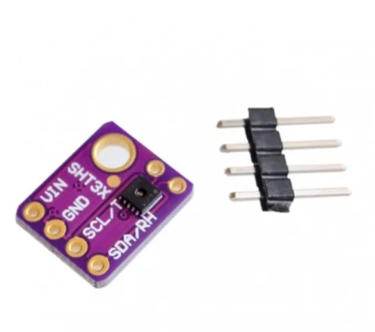

# آموزش کامل سنسور SHT31 با ESP32 و Arduino

راهنمای جامع سنسور دما و رطوبت SHT31؛ خواندن دیتاشیت، پایه‌ها، I2C، دقت، CRC، Heater و برنامه‌نویسی Arduino و ESP32 همراه با فایل نمونه.

- دسته‌بندی: دما و رطوبت
- آخرین بروزرسانی: 2026-07-30T06:54:32.784411
- نسخه اصلی در سایت: [https://lcenj.ir/learning/25/sht31-esp32-arduino-i2c](https://lcenj.ir/learning/25/sht31-esp32-arduino-i2c)

## متن مقاله

آموزش سنسور دما و رطوبت دیجیتال

راه‌اندازی سنسور SHT31 با ESP32 و Arduino

در این راهنمای جامع، ماژول SHT31 را از روی دیتاشیت رسمی Sensirion می‌شناسیم، سیم‌کشی و I2C را انجام می‌دهیم، دما و رطوبت را با کتابخانه و بدون کتابخانه می‌خوانیم و با CRC، Heater، خطاهای اندازه‌گیری و اصول نصب درست آشنا می‌شویم.

دیتاشیت رسمی SHT3x-DIS

دانلود کدهای Arduino و ESP32

دقت رطوبتتیپیک ±2 %RH

دقت دماتیپیک ±0.2°C

رابطI2C تا 1MHz

آدرس0x44 یا 0x45

SHT31 چیست و چه کاربردهایی دارد؟

SHT31-DIS یک سنسور دیجیتال کالیبره‌شده برای اندازه‌گیری هم‌زمان دما و رطوبت نسبی است. خروجی دیجیتال، جبران‌سازی داخلی، اندازه کوچک و دقت مناسب باعث شده این قطعه در دیتالاگرها، ترموستات، گلخانه، تجهیزات پزشکی غیرتشخیصی، انبار، تهویه مطبوع، ایستگاه هواشناسی و پروژه‌های IoT استفاده شود.

این خانواده چند عضو دارد. SHT30، SHT31 و SHT35 از نظر فرمان‌های ارتباطی بسیار شبیه‌اند، اما حدود دقت آن‌ها یکسان نیست. هنگام خرید، نوشته روی قطعه و شماره دقیق سفارش را بررسی کنید؛ نام عمومی «SHT3x» به‌تنهایی برای نتیجه‌گیری درباره دقت کافی نیست.

قطعه خام یا ماژول؟ مشخصات 2.15 تا 5.5 ولت مربوط به تراشه خام است. بعضی بردهای آماده رگولاتور، مبدل سطح یا مقاومت Pull-up دارند و بعضی ندارند. قبل از اتصال، شماتیک یا مسیرهای روی همان ماژول را بررسی کنید.

چطور دیتاشیت SHT31 را درست بخوانیم؟

برای انتخاب سنسور فقط به یک عدد بزرگ روی صفحه فروشگاه اکتفا نکنید. جدول‌های Electrical Specifications را همراه با شرایط آزمون بخوانید:

Accuracy یا دقت

فاصله اندازه‌گیری سنسور از مقدار واقعی است. مقدار تیپیک SHT31 برای رطوبت ±2 %RH و برای دما در بخش اصلی بازه ±0.2°C است؛ نمودار دقت نشان می‌دهد این عدد در همه دماها یکسان نیست.

Repeatability یا تکرارپذیری

پراکندگی چند اندازه‌گیری پشت‌سرهم است، نه دقت مطلق. در حالت High، تکرارپذیری رطوبت 0.08 %RH و دما 0.04°C است.

Resolution یا تفکیک‌پذیری

کوچک‌ترین گام عدد خروجی است. رزولوشن 0.01°C به معنی دقت 0.01°C نیست؛ دقت واقعی را جدول Accuracy تعیین می‌کند.

Response و Drift

زمان پاسخ رطوبت حدود 8 ثانیه و زمان پاسخ دما بیش از 2 ثانیه ذکر شده است. رانش بلندمدت رطوبت در شرایط عادی معمولاً کمتر از 0.25 %RH در سال است.

خلاصه تصویری دقت، تکرارپذیری و محدوده توصیه‌شده؛ بازطراحی‌شده بر اساس دیتاشیت رسمی Sensirion.

پارامترمقدار مهمبرداشت عملی

بازه رطوبت0 تا 100 %RHکارکرد طولانی خارج از 20 تا 80 %RH می‌تواند جابه‌جایی موقت خروجی ایجاد کند.

بازه دما-40 تا +125°Cدقت در لبه‌های بازه کمتر از محدوده معمول اتاق است؛ نمودار دقت را بخوانید.

Hysteresis رطوبتحدود ±0.8 %RHدر مسیر افزایش و کاهش رطوبت، خروجی دقیقاً روی یک منحنی قرار نمی‌گیرد.

زمان اندازه‌گیری Highتیپیک 12.5ms، حداکثر 15msدر حالت Single-shot پیش از خواندن داده باید تبدیل کامل شود.

جریان هنگام اندازه‌گیریتیپیک 600µAبرای باتری، نرخ نمونه‌برداری و حالت Single-shot را متناسب انتخاب کنید.

پایه‌ها، آدرس I2C و سیم‌کشی

پایه‌های تراشه و اتصال پیشنهادی ماژول؛ خازن 100nF باید نزدیک VDD و VSS تراشه قرار بگیرد.

پایه ماژولArduino UnoESP32توضیح

VIN / VCC5V یا 3.3V مطابق ماژولترجیحاً 3.3Vولتاژ مجاز برد آماده را از فروشنده یا شماتیک بررسی کنید.

GNDGNDGNDزمین مشترک مدار

SDAA4پایه SDA برد؛ اغلب GPIO21خط داده I2C با Pull-up

SCLA5پایه SCL برد؛ اغلب GPIO22خط کلاک I2C با Pull-up

SDA و SCL خروجی Open-drain هستند و به مقاومت Pull-up نیاز دارند. بسیاری از ماژول‌ها این مقاومت‌ها را نصب کرده‌اند. موازی شدن Pull-up چند ماژول مقاومت معادل را کم می‌کند و ممکن است به باس فشار بیاورد. مقدار مناسب به ولتاژ، فرکانس و ظرفیت کل باس بستگی دارد.

پایه ADDR آدرس را تعیین می‌کند: اتصال به VSS معمولاً آدرس 0x44 و اتصال به VDD آدرس 0x45 می‌دهد. این قابلیت اجازه می‌دهد دو SHT31 روی یک باس استفاده شوند.

حالت‌های اندازه‌گیری و فرمان‌های مهم

در حالت Single-shot، میکروکنترلر یک فرمان می‌فرستد، سنسور یک بار اندازه‌گیری می‌کند و سپس داده خوانده می‌شود. این حالت برای مصرف پایین و نمونه‌برداری آرام مناسب است. در حالت Periodic، سنسور با نرخ 0.5 تا 10 نمونه بر ثانیه اندازه‌گیری می‌کند و نتیجه با فرمان Fetch Data خوانده می‌شود.

حالت Single-shotHighMediumLow

Clock stretching غیرفعال0x24000x240B0x2416

Clock stretching فعال0x2C060x2C0D0x2C10

برای شکستن حالت Periodic از 0x3093 و برای Soft Reset از 0x30A2 استفاده می‌شود. در نرخ‌های بالا، اندازه‌گیری پیوسته می‌تواند تراشه را کمی گرم کند و دمای خوانده‌شده را بالا ببرد؛ نرخ را فقط به اندازه نیاز پروژه انتخاب کنید.

ساختار داده، تبدیل مقدار خام و CRC

پاسخ اندازه‌گیری شامل دو بایت دما، CRC دما، دو بایت رطوبت و CRC رطوبت است.

پس از فرمان اندازه‌گیری، شش بایت خوانده می‌شود. مقدار خام 16 بیتی با رابطه‌های زیر تبدیل می‌شود:

temperatureC = -45.0 + 175.0 * rawTemperature / 65535.0;

relativeHumidity = 100.0 * rawHumidity / 65535.0;

برای اطمینان از سالم بودن انتقال، هر دو بخش CRC جداگانه دارند. CRC-8 این خانواده با چندجمله‌ای 0x31 و مقدار آغازین 0xFF محاسبه می‌شود. در محصول واقعی، به‌خصوص روی کابل بلند، حذف بررسی CRC تصمیم درستی نیست.

راه‌اندازی Arduino با کتابخانه Adafruit SHT31

- در Library Manager عبارت Adafruit SHT31 را نصب کنید.

- اتصالات I2C را انجام دهید و ابتدا آدرس 0x44 را امتحان کنید.

- Serial Monitor را روی 115200 قرار دهید.

#include <Wire.h>

#include <Adafruit_SHT31.h>

Adafruit_SHT31 sht31 = Adafruit_SHT31();

void setup() {

Serial.begin(115200);

Wire.begin();

if (!sht31.begin(0x44)) {

Serial.println("SHT31 not found");

while (true) delay(10);

}

}

void loop() {

const float temperature = sht31.readTemperature();

const float humidity = sht31.readHumidity();

if (!isnan(temperature) && !isnan(humidity)) {

Serial.printf("T: %.2f C | RH: %.2f %%\n", temperature, humidity);

} else {

Serial.println("Read error");

}

delay(2000);

}

خواندن مستقیم SHT31 با ESP32 و Wire

کد زیر فرمان High repeatability بدون Clock stretching را می‌فرستد، 15 میلی‌ثانیه صبر می‌کند، شش بایت را می‌خواند و CRC هر بخش را کنترل می‌کند. در بردهایی که پایه پیش‌فرض I2C متفاوت است، از Wire.begin(SDA_PIN, SCL_PIN) استفاده کنید.

#include <Wire.h>

constexpr uint8_t SHT31_ADDRESS = 0x44;

uint8_t crc8(const uint8_t *data, size_t len) {

uint8_t crc = 0xFF;

for (size_t i = 0; i < len; ++i) {

crc ^= data[i];

for (uint8_t bit = 0; bit < 8; ++bit)

crc = (crc & 0x80) ? (crc << 1) ^ 0x31 : (crc << 1);

}

return crc;

}

bool readSHT31(float &t, float &rh) {

Wire.beginTransmission(SHT31_ADDRESS);

Wire.write(0x24);

Wire.write(0x00);

if (Wire.endTransmission() != 0) return false;

delay(15);

if (Wire.requestFrom(SHT31_ADDRESS, (uint8_t)6) != 6) return false;

uint8_t data[6];

for (uint8_t &byte : data) byte = Wire.read();

if (crc8(data, 2) != data[2] || crc8(data + 3, 2) != data[5]) return false;

const uint16_t rawT = (uint16_t(data[0]) << 8) | data[1];

const uint16_t rawRH = (uint16_t(data[3]) << 8) | data[4];

t = -45.0f + 175.0f * rawT / 65535.0f;

rh = 100.0f * rawRH / 65535.0f;

return true;

}

void setup() {

Serial.begin(115200);

Wire.begin();

}

void loop() {

float temperature, humidity;

if (readSHT31(temperature, humidity))

Serial.printf("T: %.2f C | RH: %.2f %%\n", temperature, humidity);

else

Serial.println("I2C or CRC error");

delay(2000);

}

Heater، نصب مکانیکی و خطاهای واقعی اندازه‌گیری

گرم‌کن داخلی برای بررسی و مدیریت شرایط خاص مانند میعان طراحی شده است؛ روشن بودن آن دمای خود سنسور را افزایش می‌دهد و در همان زمان، عدد دمای محیط و رطوبت معتبر نیست. Heater را دائماً روشن نگذارید و آن را جایگزین طراحی مکانیکی درست نکنید.

- سنسور را از رگولاتور، پردازنده، نمایشگر و مسیرهای پرجریان دور کنید.

- جریان هوای محیط باید به سنسور برسد؛ قرار دادن آن در محفظه بسته، پاسخ را کند می‌کند.

- بخار مواد شیمیایی، چسب، حلال و سیلیکون می‌تواند روی عنصر رطوبت اثر بگذارد.

- در کاربرد بیرونی از فیلتر مناسب و محافظ در برابر قطره مستقیم آب استفاده کنید.

- برای کابل بلند، سرعت I2C را کاهش دهید یا از قرار دادن I2C خام روی کابل بلند خودداری کنید.

محدوده توصیه‌شده: دیتاشیت برای پایداری بلندمدت، ناحیه معمول 5 تا 60°C و 20 تا 80 %RH را توصیه می‌کند. ماندن طولانی در رطوبت بالاتر از 80 درصد می‌تواند آفست مثبت موقت ایجاد کند.

خطاهای رایج و عیب‌یابی

نشانهعلت‌های محتملراه‌حل

سنسور پیدا نمی‌شودآدرس اشتباه، جابه‌جایی SDA/SCL، نبود زمین مشترکاسکنر I2C را اجرا و آدرس‌های 0x44 و 0x45 را بررسی کنید.

دما بیشتر از محیط استگرمای برد، نرخ نمونه‌برداری زیاد یا Heater روشنفاصله حرارتی، نرخ کمتر و وضعیت Heater را بررسی کنید.

رطوبت ثابت یا غیرعادیمحفظه بسته، آلودگی شیمیایی یا میعانتهویه، جانمایی و شرایط نگهداری سنسور را اصلاح کنید.

خطای تصادفیPull-up نامناسب، کابل بلند، نویز یا تغذیه ضعیفCRC، خازن 100nF، شکل موج I2C و زمین را بررسی کنید.

مقایسه SHT31 با DHT22، BME280 و DS18B20

سنسوراندازه‌گیریمزیت اصلیمناسب برای

SHT31دما و رطوبتدقت، پاسخ و رابط I2C مناسباندازه‌گیری قابل اعتماد دما و رطوبت

DHT22دما و رطوبتسادگی و قیمت پایینپروژه آموزشی با نرخ پایین

BME280دما، رطوبت، فشاراندازه‌گیری فشار هواایستگاه هواشناسی و ارتفاع نسبی

DS18B20فقط دما1-Wire، چند سنسور و نسخه ضدآباندازه‌گیری نقطه‌ای دما و کابل بلندتر

پرسش‌های متداول

آیا SHT31 مستقیماً با ESP32 سازگار است؟بله. تراشه با 3.3 ولت کار می‌کند و I2C آن با ESP32 سازگار است. Pull-up باس باید به 3.3 ولت متصل باشد.

چرا رزولوشن 0.01 درجه با دقت ±0.2 درجه فرق دارد؟رزولوشن تعداد رقم‌های خروجی را مشخص می‌کند؛ دقت نشان می‌دهد خروجی تا چه اندازه به مقدار واقعی نزدیک است.

آیا می‌توان دو SHT31 را روی یک باس بست؟بله؛ یکی را روی آدرس 0x44 و دیگری را با تنظیم ADDR روی 0x45 قرار دهید.

آیا Heater باید همیشه فعال باشد؟خیر. Heater سنسور را گرم می‌کند و هنگام فعالیت آن، اندازه‌گیری دمای محیط و رطوبت قابل اتکا نیست.

منابع و ادامه مسیر

- دیتاشیت رسمی خانواده SHT3x-DIS از Sensirion

- صفحه رسمی محصول SHT31-DIS-B

- آموزش سنسور دمای DS18B20 با Arduino و ESP32

- مقاله‌های سنسورهای دما و رطوبت

- مرکز آموزش سنسورها

اعداد فنی این مقاله با Datasheet SHT3x-DIS نسخه 7، دسامبر 2022 تطبیق داده شده‌اند. مشخصات ماژول آماده ممکن است با تراشه خام تفاوت داشته باشد.

## فایل‌ها

نسخه HTML، CSS، تصاویر، رسانه‌ها و بسته اصلی مقاله در همین پوشه قرار گرفته‌اند.
