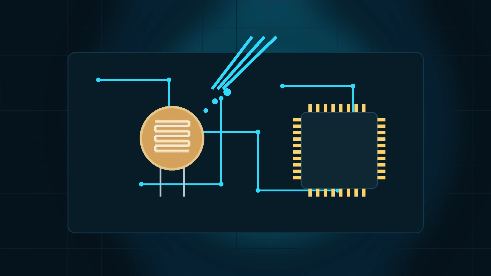

# سنسور نور LDR چیست؟ نحوه کار، کاربردها و راه‌اندازی

در این مقاله با سنسور نور LDR، نحوه عملکرد، ویژگی‌ها و کاربردهای آن آشنا می‌شویم و بررسی می‌کنیم چگونه می‌توان با استفاده از LDR شدت نور محیط را تشخیص داد و در پروژه‌های الکترونیکی از آن استفاده کرد.

- دسته‌بندی: نور
- آخرین بروزرسانی: 2026-08-04T10:07:34.847500
- نسخه اصلی در سایت: [https://lcenj.ir/learning/27/سنسور-نور-ldr-چیست؟-نحوه-کار،-کاربردها-و-راه-اندازی](https://lcenj.ir/learning/27/سنسور-نور-ldr-چیست؟-نحوه-کار،-کاربردها-و-راه-اندازی)

## متن مقاله

سنسور نور LDR چیست؟

نمای فنی سنسور نور LDR و کاربرد آن در یک مدار اندازه‌گیری شدت نور.

مقدمه کاربردی

سنسور نور LDR یا Light Dependent Resistor یکی از ساده‌ترین قطعات برای تشخیص شدت نور محیط در پروژه‌های الکترونیکی است. این قطعه در چراغ‌های خودکار، کنترل روشنایی نمایشگر، تشخیص روز و شب، پروژه‌های رباتیک، آلارم نوری و اندازه‌گیری تقریبی روشنایی محیط به‌کار می‌رود. اگر هدف شما خواندن تغییرات نور با میکروکنترلر باشد، LDR معمولاً به‌صورت یک تقسیم ولتاژ به ورودی ADC متصل می‌شود.

در این مقاله، ساختار و نحوه عملکرد LDR، پارت‌های رایج مثل GL5528 و GL5537، پایه‌ها، خطاهای رایج، ابزار تست و یک مثال عملی با STM32 بررسی می‌شود. لحن مقاله تبلیغاتی نیست و تلاش شده محتوا برای مهندس الکترونیک و کاربر فنی قابل استفاده باشد.

سنسور LDR چگونه کار می‌کند؟

LDR یک مقاومت نوری است که مقدار مقاومت آن با شدت نور تغییر می‌کند. در تاریکی، مقاومت قطعه بالا است و با افزایش نور، مقاومت کاهش می‌یابد. ماده حساس به نور در بسیاری از LDRهای متداول از خانواده CdS یا سولفید کادمیم است. به همین دلیل، رفتار این قطعه نسبت به نور کاملاً خطی نیست و باید در تحلیل مدار به این موضوع توجه کرد.

LDR قطعه‌ای دو پایه است و برخلاف سنسورهای دیجیتال، هیچ پروتکل ارتباطی مثل I2C، SPI یا UART ندارد. خروجی آن در واقع یک تغییر مقاومتی است و برای استفاده عملی باید همراه با یک مقاومت ثابت، تقسیم ولتاژ ساخته شود.

- در نور کم: مقاومت LDR زیاد می‌شود.

- در نور زیاد: مقاومت LDR کاهش پیدا می‌کند.

- خروجی نهایی: ولتاژی متغیر در نقطه میانی تقسیم ولتاژ.

- کاربرد اصلی: تشخیص تقریبی شدت روشنایی، نه اندازه‌گیری دقیق لوکس.

مدار پایه راه‌اندازی LDR

دیاگرام مفهومی تقسیم ولتاژ با LDR و اتصال نقطه میانی به ورودی ADC میکروکنترلر.

در رایج‌ترین روش، یک پایه LDR به VCC و پایه دیگر آن به نقطه میانی تقسیم ولتاژ متصل می‌شود. از این نقطه، یک مقاومت ثابت به GND وصل می‌شود. ولتاژ نقطه میانی به ورودی ADC داده می‌شود. انتخاب مقدار مقاومت ثابت روی محدوده حساسیت مدار اثر مستقیم دارد؛ در عمل، مقاومت‌های 10kΩ یا 47kΩ برای شروع مناسب هستند.

مشخصات مهم برای انتخاب سنسور نور LDR

پارامتر

توضیح فنی

نکته کاربردی

پارت

نمونه‌های رایج شامل GL5528 و GL5537 هستند.

قبل از طراحی، دیتاشیت همان پارت را بررسی کنید.

مقاومت روشن / تاریک

مقدار مقاومت در شرایط نوری مختلف تغییر می‌کند.

این مقدار تعیین می‌کند نقطه کاری تقسیم ولتاژ کجا باشد.

زمان پاسخ

LDR نسبت به فوتودیود و فوتوترانزیستور کندتر است.

برای تشخیص سریع پالس نوری مناسب نیست.

طول موج حساسیت

بیشترین حساسیت معمولاً نزدیک طیف مرئی است.

برای نور محیط و روشنایی عمومی مناسب‌تر از نورهای خاص است.

تلرانس و تکرارپذیری

قطعات مختلف می‌توانند پراکندگی قابل توجهی داشته باشند.

برای اندازه‌گیری دقیق، کالیبراسیون لازم است.

شرایط محیطی

دما، گردوغبار، زاویه تابش و پیری قطعه روی خروجی اثر دارند.

در پروژه‌های بیرونی باید شیلد نوری و مکانیکی در نظر گرفته شود.

تفاوت LDR با فوتودیود و فوتوترانزیستور

LDR برای پروژه‌های ساده، ارزان و آموزشی بسیار مناسب است، اما نباید آن را با سنسورهای سریع‌تر اشتباه گرفت. فوتودیود و فوتوترانزیستور در پاسخ زمانی، خطی بودن و رفتار فرکانسی معمولاً عملکرد بهتری دارند. اگر هدف شما فقط تشخیص روز و شب یا تغییر نسبی روشنایی باشد، LDR گزینه قابل قبولی است. اگر قصد اندازه‌گیری سریع یا دقیق دارید، باید گزینه‌های دیگر را بررسی کنید.

مثال عملی با STM32 و ADC

در این مثال، نقطه میانی تقسیم ولتاژ به یکی از پایه‌های آنالوگ مانند PA0 / ADC1_IN0 وصل می‌شود. سپس مقدار ADC خوانده می‌شود و بر اساس آستانه تعیین‌شده، LED روی PA5 روشن یا خاموش می‌شود. فایل کامل نمونه کد در assets/source-code.zip قرار داده شده است.

#include "main.h"

#include <stdio.h>

extern ADC_HandleTypeDef hadc1;

static uint32_t ldr_read_adc(void)

{

HAL_ADC_Start(&hadc1);

HAL_ADC_PollForConversion(&hadc1, 10);

uint32_t value = HAL_ADC_GetValue(&hadc1);

HAL_ADC_Stop(&hadc1);

return value;

}

void app_ldr_task(void)

{

uint32_t adc = ldr_read_adc();

if (adc > 2500)

HAL_GPIO_WritePin(GPIOA, GPIO_PIN_5, GPIO_PIN_SET);

else

HAL_GPIO_WritePin(GPIOA, GPIO_PIN_5, GPIO_PIN_RESET);

}

آستانه 2500 فقط یک مثال است. مقدار واقعی به ولتاژ تغذیه، مقدار مقاومت ثابت، نوع LDR و شرایط نوری بستگی دارد و باید با تست عملی و ابزار اندازه‌گیری تنظیم شود.

آرایش تست و ابزار مناسب

نمونه آرایش تست LDR روی برد، همراه با میکروکنترلر و ابزار اندازه‌گیری برای بررسی رفتار مدار.

- مولتی‌متر برای اندازه‌گیری مقاومت LDR در نور و تاریکی.

- منبع تغذیه پایدار 3.3V یا 5V برای کاهش خطای اندازه‌گیری.

- اسیلوسکوپ در صورت بررسی نویز یا رفتار نقطه میانی تقسیم ولتاژ.

- چراغ‌قوه، منبع نور ثابت یا جعبه تست تاریک برای ایجاد شرایط قابل تکرار.

خطاهای رایج و نکات ایمنی

خطاهای متداول

- انتخاب مقاومت ثابت نامناسب و خارج شدن خروجی از محدوده مفید ADC.

- اتصال LDR با سیم بلند و گرفتن نویز محیط، مخصوصاً نزدیک بارهای سوئیچینگ.

- قضاوت اشتباه بر اساس یک تست کوتاه بدون کالیبراسیون در نورهای مختلف.

- استفاده از LDR برای کاربردهایی که پاسخ زمانی سریع لازم دارند.

نکات مهم

اگر از LDRهای مبتنی بر CdS استفاده می‌کنید، در کاربردهای خاص به الزامات محیط‌زیستی و محدودیت‌های مواد توجه کنید. همچنین در طراحی صنعتی، محافظت مکانیکی و کنترل زاویه تابش نور اهمیت زیادی دارد.

برای جلوگیری از خطای خواندن ADC، یک خازن کوچک مانند 100nF نزدیک تغذیه میکروکنترلر و در صورت نیاز یک فیلتر نرم‌افزاری میانگین‌گیر در برنامه استفاده کنید.

پیشنهاد تست عملی

یک LDR پارت GL5528 را با مقاومت 10kΩ به‌صورت تقسیم ولتاژ ببندید و خروجی را به ADC میکروکنترلر وصل کنید. سپس سه وضعیت نور محیط، نور چراغ‌قوه و تاریکی نسبی را ایجاد کنید و مقدار ADC را یادداشت کنید. در گام بعد، مقدار مقاومت ثابت را به 47kΩ تغییر دهید و دوباره همین تست را تکرار کنید. این آزمایش ساده نشان می‌دهد انتخاب مقاومت ثابت چگونه روی حساسیت و محدوده خواندن اثر می‌گذارد.

جمع‌بندی

LDR یک قطعه ساده، کم‌هزینه و کاربردی برای تشخیص شدت نور محیط است. خروجی آن دیجیتال یا مبتنی بر پروتکل نیست، بلکه تغییر مقاومتی دارد و معمولاً در قالب یک تقسیم ولتاژ خوانده می‌شود. در انتخاب این قطعه باید به پارت، مقاومت روشن و تاریک، زمان پاسخ، شرایط محیطی، تلرانس، خطاهای نصب و نوع کاربرد توجه کرد. برای پروژه‌های آموزشی و کاربردهای ساده، LDR انتخاب خوبی است؛ اما برای پاسخ سریع یا اندازه‌گیری دقیق، باید گزینه‌های دیگر نیز ارزیابی شوند.

## فایل‌ها

نسخه HTML، CSS، تصاویر، رسانه‌ها و بسته اصلی مقاله در همین پوشه قرار گرفته‌اند.
