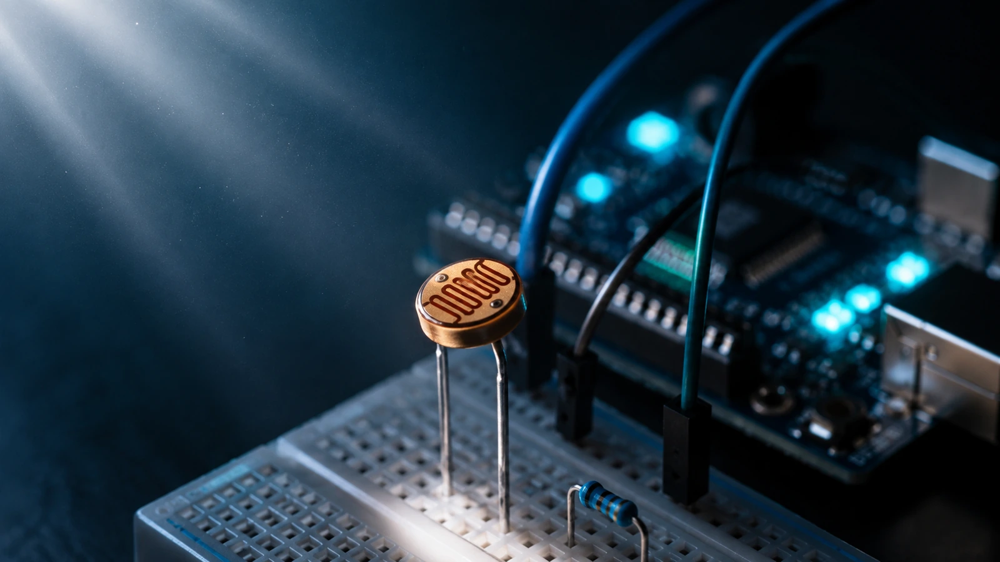

# سنسور نور LDR چیست؟ نحوه کار، کاربردها و راه‌اندازی

در این مقاله با سنسور نور LDR، نحوه عملکرد، ویژگی‌ها و کاربردهای آن آشنا می‌شویم و بررسی می‌کنیم چگونه می‌توان با استفاده از LDR شدت نور محیط را تشخیص داد و در پروژه‌های الکترونیکی از آن استفاده کرد.

- دسته‌بندی: نور
- آخرین بروزرسانی: 2026-08-04T10:27:03.193172
- نسخه اصلی در سایت: [https://lcenj.ir/learning/27/سنسور-نور-ldr-چیست؟-نحوه-کار،-کاربردها-و-راه-اندازی](https://lcenj.ir/learning/27/سنسور-نور-ldr-چیست؟-نحوه-کار،-کاربردها-و-راه-اندازی)

## متن مقاله

سنسور نور LDR چیست؟

سنسور LDR در یک مدار آزمایشی؛ مقاومت این قطعه با تغییر شدت نور تغییر می‌کند.

مقدمه؛ LDR در پروژه واقعی چه کاری انجام می‌دهد؟

LDR یا Light Dependent Resistor یک مقاومت وابسته به نور است. برخلاف سنسورهای دیجیتال، LDR پروتکل I2C، SPI یا UART ندارد و پایه‌های آن نیز قطب مثبت و منفی ندارند. خروجی واقعی قطعه، تغییر مقاومت الکتریکی است؛ بنابراین معمولاً آن را همراه یک مقاومت ثابت به شکل تقسیم ولتاژ می‌بندیم و ولتاژ خروجی را با ADC میکروکنترلر می‌خوانیم.

کاربرد متداول LDR شامل تشخیص روز و شب، روشن و خاموش کردن خودکار چراغ، پایش نسبی روشنایی محیط، پروژه‌های رباتیک و ساخت ورودی نوری ساده است. نکته مهم این است که LDR برای اندازه‌گیری دقیق Lux طراحی نشده و برای کاربردهای دقیق‌تر باید از سنسورهای کالیبره‌شده نوری استفاده شود.

ساختار و نحوه کار سنسور LDR

سطح LDR از یک مسیر مقاومتی حساس به نور ساخته می‌شود. با افزایش تابش نور، تعداد حامل‌های بار در ماده حساس بیشتر شده و مقاومت کاهش پیدا می‌کند. در تاریکی مقاومت می‌تواند به محدوده مگااهم برسد و در نور معمولی به چند کیلو‌اهم تا چند ده کیلو‌اهم کاهش پیدا کند.

- دو پایه دارد و پایه‌ها بدون پلاریته هستند.

- خروجی آن مقاومت متغیر است، نه ولتاژ دیجیتال.

- پروتکل ارتباطی ندارد و برای خواندن با میکروکنترلر معمولاً به ADC نیاز داریم.

- رفتار مقاومت نسبت به شدت نور خطی نیست.

- پارت‌های رایج بازار شامل GL5528 و مدل‌های مشابه خانواده GL55xx هستند.

نمونه مدار واقعی روی بردبرد

نمونه چیدمان آزمایشگاهی LDR روی بردبرد برای ساخت تقسیم ولتاژ و اتصال خروجی به ADC.

در مدار عملی، یک پایه LDR به 3.3V متصل می‌شود و پایه دیگر آن به گره VOUT می‌رود. یک مقاومت ثابت مانند 10kΩ نیز از VOUT به GND وصل می‌شود. گره VOUT مستقیماً به یک پایه ADC مانند PA0/ADC1_IN0 در STM32 متصل می‌شود. با بیشتر شدن نور، مقاومت LDR کاهش پیدا می‌کند و در این آرایش، ولتاژ VOUT افزایش می‌یابد.

شماتیک پیشنهادی LDR برای ADC

شماتیک پیشنهادی: LDR به 3.3V، مقاومت 10kΩ به زمین، VOUT به ADC و خازن 100nF اختیاری برای کاهش نویز.

برای این آرایش رابطه تقریبی تقسیم ولتاژ برابر است با VOUT = VCC × R1 / (RLDR + R1). چون RLDR با افزایش نور کاهش می‌یابد، VOUT بیشتر می‌شود. اگر جای LDR و مقاومت ثابت عوض شود، جهت تغییر ولتاژ نیز برعکس خواهد شد.

پارامترهای مهم هنگام انتخاب LDR

پارامتر

معنی

اثر در طراحی

Light Resistance

مقاومت قطعه در شدت نور مشخص، معمولاً 10 Lux

مقدار مقاومت ثابت تقسیم ولتاژ را تحت تأثیر قرار می‌دهد.

Dark Resistance

مقاومت LDR در تاریکی

دامنه تغییر VOUT و حساسیت به تاریکی را مشخص می‌کند.

Response Time

زمان واکنش به تغییر نور

LDR برای پالس‌های نوری سریع مناسب نیست.

Spectral Response

حساسیت نسبت به طول موج‌های مختلف نور

برای نور مرئی مناسب است ولی رفتار آن با منابع نوری مختلف یکسان نیست.

Power / Max Voltage

حداکثر توان و ولتاژ مجاز قطعه

در مدارهای میکروکنترلری معمولاً محدودیت اصلی نیست، ولی دیتاشیت پارت باید بررسی شود.

برای پارت رایج GL5528 معمولاً مقاومت در 10 Lux در محدوده چند ده کیلو‌اهم و مقاومت تاریکی در محدوده مگااهم است؛ عدد دقیق را باید از دیتاشیت همان سازنده و همان Batch قطعه بررسی کنید.

انتخاب مقاومت تقسیم ولتاژ

یک انتخاب اولیه مناسب برای R1 معمولاً 10kΩ است، اما مقدار بهینه به محدوده نور پروژه بستگی دارد. اگر محیط بسیار تاریک است یا مقاومت LDR در نقطه کاری بالا است، ممکن است 47kΩ یا 100kΩ نتیجه بهتری بدهد. برای بیشترین حساسیت، بهتر است مقدار مقاومت ثابت تقریباً هم‌اندازه مقاومت LDR در نقطه نوری موردنظر انتخاب شود.

در ورودی ADC میکروکنترلرهایی مانند STM32، بالا بودن امپدانس منبع می‌تواند باعث خطای Sample-and-Hold شود. در چنین شرایطی Sample Time را افزایش دهید، مقدار تقسیم ولتاژ را بیش از حد بزرگ انتخاب نکنید یا در طراحی دقیق از Buffer Op-Amp استفاده کنید.

مثال خواندن LDR با STM32

در نمونه زیر فرض شده تقسیم ولتاژ به ADC1 متصل است. چند نمونه ADC میانگین‌گیری می‌شوند تا اثر نویز کمتر شود. مقدار آستانه 2500 فقط نمونه است و باید در محیط واقعی کالیبره شود.

#define LDR_SAMPLES 16U

static uint32_t ldr_read_adc_average(void)

{

uint32_t sum = 0;

for (uint32_t i = 0; i < LDR_SAMPLES; ++i)

{

HAL_ADC_Start(&hadc1);

HAL_ADC_PollForConversion(&hadc1, 20);

sum += HAL_ADC_GetValue(&hadc1);

HAL_ADC_Stop(&hadc1);

}

return sum / LDR_SAMPLES;

}

فایل کامل نمونه کد از مسیر assets/source-code.zip قابل دریافت است.

ابزار تست پیشنهادی

- مولتی‌متر برای اندازه‌گیری مستقیم مقاومت LDR در نور و تاریکی.

- مولتی‌متر یا اسیلوسکوپ برای بررسی VOUT تقسیم ولتاژ.

- چراغ‌قوه یا منبع نور قابل تکرار برای مقایسه تست‌ها.

- اسیلوسکوپ برای مشاهده نویز، Flicker منبع نور و زمان پاسخ.

- Lux Meter در صورت نیاز به مقایسه تقریبی خروجی ADC با شدت روشنایی واقعی.

خطاهای رایج در استفاده از LDR

- اتصال مستقیم LDR به ADC بدون تشکیل تقسیم ولتاژ.

- فرض کردن خطی بودن رابطه Lux و مقاومت LDR.

- انتخاب مقاومت ثابت نامناسب و اشباع شدن مقدار ADC در نور یا تاریکی.

- استفاده از سیم‌های بلند بدون توجه به نویز و ورودی ADC.

- Sample Time کوتاه ADC در زمانی که امپدانس منبع زیاد است.

- قرار دادن LDR در معرض مستقیم LED نزدیک برد و اندازه‌گیری نور خود مدار به جای نور محیط.

- استفاده از LDR برای اندازه‌گیری سریع پالس نور؛ در این حالت فوتودیود یا فوتوترانزیستور مناسب‌تر است.

نکته فنی و ایمنی

برخی LDRهای متداول از مواد حساس نوری مبتنی بر CdS استفاده می‌کنند. برای محصول تجاری، محدودیت‌های مواد و الزامات RoHS را بر اساس پارت و بازار هدف بررسی کنید. همچنین LDR را خارج از محدوده ولتاژ و توان دیتاشیت استفاده نکنید.

پیشنهاد تست عملی

یک GL5528، یک مقاومت 10kΩ و یک برد STM32 آماده کنید. ابتدا مقاومت LDR را با مولتی‌متر در تاریکی، نور اتاق و زیر چراغ‌قوه اندازه بگیرید. سپس مدار تقسیم ولتاژ 3.3V را ببندید و VOUT را هم با مولتی‌متر و هم ADC بخوانید. بعد مقاومت 10kΩ را با 47kΩ جایگزین کنید و مقادیر را دوباره ثبت کنید. این آزمایش به‌صورت عملی نشان می‌دهد چرا انتخاب مقاومت ثابت روی حساسیت مدار تأثیر دارد.

جمع‌بندی

LDR یک سنسور نوری بسیار ساده و ارزان است که در واقع مانند یک مقاومت متغیر با نور رفتار می‌کند. این قطعه دو پایه بدون پلاریته دارد، پروتکل دیجیتال ندارد و برای اتصال به میکروکنترلر معمولاً در یک تقسیم ولتاژ استفاده می‌شود. برای طراحی قابل اعتماد باید پارت واقعی، مقاومت در نور و تاریکی، امپدانس ورودی ADC، Sample Time، نویز، زمان پاسخ و شرایط محیطی بررسی شوند.

## فایل‌ها

نسخه HTML، CSS، تصاویر، رسانه‌ها و بسته اصلی مقاله در همین پوشه قرار گرفته‌اند.
