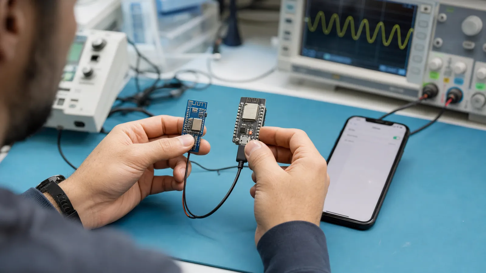

# آموزش BLE از صفر: مبانی، تاریخچه و مقایسه با فناوری‌های بی‌سیم

Bluetooth Low Energy چیست، چرا ساخته شد و چه زمانی باید آن را به‌جای Bluetooth Classic، Wi-Fi، Zigbee، NFC یا LoRa انتخاب کنیم؟

- دسته‌بندی: آموزش جامع BLE
- آخرین بروزرسانی: 2026-07-15T07:39:44.235911
- نسخه اصلی در سایت: [https://lcenj.ir/learning/3/ble-fundamentals-history-comparison](https://lcenj.ir/learning/3/ble-fundamentals-history-comparison)

## متن مقاله

مرحله 1 از ۲۰ مسیر تسلط بر BLE

BLE یا Bluetooth Low Energy شاخه‌ای از خانواده بلوتوث است که برای دستگاه‌های کم‌مصرف، سنسورها، پوشیدنی‌ها و محصولات باتری‌خور طراحی شده است. هدف این مرحله آن است که قبل از ورود به پکت و کدنویسی، تصویر درستی از مسئله داشته باشید و بدانید BLE چه کاری را خوب انجام می‌دهد و چه کاری را نه.

در پایان این مقاله چه یاد می‌گیرید؟- BLE چیست

- Bluetooth Low Energy

- تفاوت BLE و Bluetooth

- آموزش BLE

از Bluetooth Classic تا BLE

Bluetooth Classic برای ارتباط پیوسته‌ای مثل صدا و انتقال نسبتاً حجیم داده مناسب است. BLE از نسخه 4.0 وارد مشخصات بلوتوث شد و به‌جای روشن نگه داشتن دائمی رادیو، بیشتر زمان را در خواب می‌گذراند و در بازه‌های کوتاه تبلیغ یا تبادل داده می‌کند. نسخه‌های 4.2 و خانواده 5 قابلیت‌هایی مانند بسته بزرگ‌تر، سرعت 2M، برد بیشتر با LE Coded و Advertising توسعه‌یافته را اضافه کردند. شماره نسخه به‌تنهایی کافی نیست؛ باید جدول قابلیت‌های تراشه و پشته نرم‌افزاری را هم بررسی کنید.

BLE را با چه فناوری‌ای مقایسه کنیم؟

Wi-Fi برای پهنای باند زیاد و اتصال مستقیم به شبکه IP بهتر است اما معمولاً انرژی بیشتری مصرف می‌کند. Zigbee برای شبکه مش کم‌مصرف چندگرهی مناسب است. NFC برد بسیار کوتاه و تجربه نزدیک‌کردن دستگاه‌ها را فراهم می‌کند. LoRa داده کم را در مسافت زیاد می‌فرستد. UART و USB بی‌سیم نیستند اما برای دیباگ، برنامه‌ریزی و اتصال مطمئن محلی همچنان مهم‌اند. انتخاب درست از نیاز محصول شروع می‌شود، نه از نام فناوری.

پنج معیار ساده برای انتخاب

برای هر پروژه پنج سؤال بنویسید: چه مقدار داده در ثانیه دارید؟ بیشترین تأخیر قابل قبول چقدر است؟ دستگاه چند ماه یا چند سال باید با باتری کار کند؟ فاصله و محیط انتشار چیست؟ ارتباط نقطه‌به‌نقطه است یا چندگرهی؟ BLE برای پیام‌های کوتاه، کشف نزدیک، اتصال به موبایل و مصرف کم گزینه بسیار خوبی است؛ برای ویدئو یا فایل بزرگ انتخاب مناسبی نیست.

مثال قابل لمس

فرض کنید یک دماسنج هر 10 ثانیه فقط دما و رطوبت را می‌فرستد. این داده شاید کمتر از 10 بایت باشد و رادیو لازم نیست دائم روشن بماند؛ BLE مناسب است. اما دوربین باید پیوسته چند مگابیت داده بفرستد، بنابراین Wi-Fi منطقی‌تر است. همین مقایسه ساده جلوی بسیاری از انتخاب‌های اشتباه ابتدای پروژه را می‌گیرد.

تمرین تصمیم‌گیری

سه محصول «دماسنج باتری‌خور»، «اسپیکر بی‌سیم» و «دوربین نظارتی» را روی کاغذ بنویسید. برای هرکدام حجم داده، تأخیر، برد و منبع تغذیه را مشخص کنید. سپس دلیل انتخاب BLE، Classic یا Wi-Fi را در یک جمله بنویسید.

چک‌لیست یادگیری

- مفهوم را با زبان خودتان توضیح دهید.

- مثال مقاله را روی کاغذ یا برد واقعی تکرار کنید.

- نتیجه، خطا و سؤال خود را یادداشت کنید.

- پس از اطمینان، به مرحله بعد بروید.

ادامه مسیر BLE

مرحله 2: لایه فیزیکی BLE: فرکانس، کانال‌ها، PHY و پرش فرکانسی

منابع رسمی برای مطالعه بیشتر

- راهنمای رسمی Bluetooth LE

- Bluetooth Core Specification

- مستندات رسمی BLE در ESP-IDF

## فایل‌ها

نسخه HTML، CSS، تصاویر، رسانه‌ها و بسته اصلی مقاله در همین پوشه قرار گرفته‌اند.
