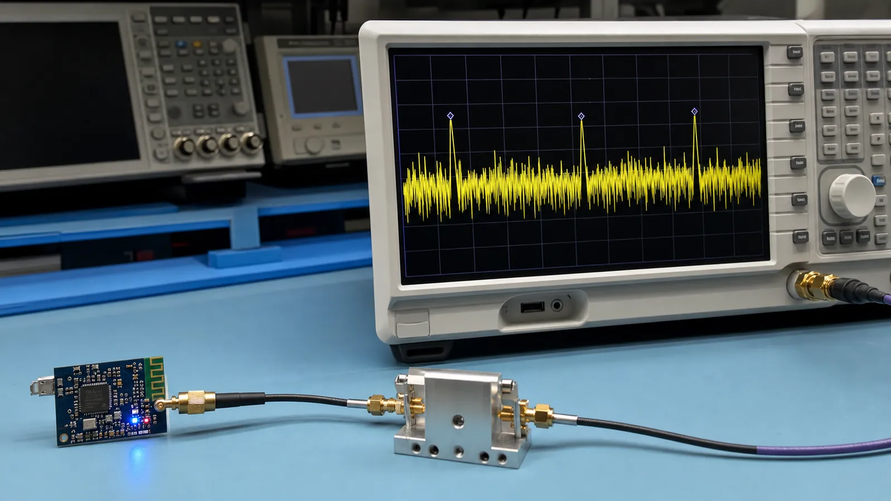

# لایه فیزیکی BLE: فرکانس، کانال‌ها، PHY و پرش فرکانسی

با باند 2.4 گیگاهرتز، 40 کانال BLE، مدولاسیون GFSK، حالت‌های 1M و 2M و LE Coded و نقش Channel Hopping آشنا شوید.

- دسته‌بندی: آموزش جامع BLE
- آخرین بروزرسانی: 2026-07-18T01:33:23.633845
- نسخه اصلی در سایت: [https://lcenj.ir/learning/4/ble-physical-layer-channels-phy](https://lcenj.ir/learning/4/ble-physical-layer-channels-phy)

## متن مقاله

مرحله 2 از ۲۰ مسیر تسلط بر BLE

هر بیت BLE در نهایت به موج رادیویی در باند 2.4 گیگاهرتز تبدیل می‌شود. شناخت لایه فیزیکی کمک می‌کند علت افت برد، تداخل Wi-Fi، تفاوت سرعت‌ها و اثر آنتن را بفهمید و تنظیمات رادیو را کورکورانه انتخاب نکنید.

در پایان این مقاله چه یاد می‌گیرید؟- BLE PHY

- کانال های BLE

- LE Coded PHY

- فرکانس BLE

باند 2.4 گیگاهرتز و 40 کانال

BLE در باند آزاد ISM کار می‌کند و 40 کانال با فاصله 2 مگاهرتز دارد. سه کانال اصلی 37، 38 و 39 برای Advertising اولیه استفاده می‌شوند و طوری پخش شده‌اند که احتمال برخورد هم‌زمان با کانال‌های رایج Wi-Fi کمتر شود. 37 کانال دیگر برای تبادل داده در اتصال به کار می‌روند.

GFSK و مفهوم PHY

در GFSK اطلاعات با تغییر کنترل‌شده فرکانس حامل منتقل می‌شود. فیلتر گاوسی پهنای طیف را محدود می‌کند تا انرژی کمتری به کانال‌های مجاور نشت کند. PHY فقط سرعت اسمی نیست؛ روش کدگذاری، حساسیت گیرنده، زمان روی هوا و در نتیجه مصرف انرژی را هم تغییر می‌دهد.

1M، 2M و LE Coded

LE 1M انتخاب عمومی و سازگار است. LE 2M زمان ارسال یک حجم ثابت داده را کم می‌کند و در شرایط مناسب Throughput را بالا می‌برد، ولی حساسیت و برد آن معمولاً کمتر از 1M است. LE Coded با افزونگی بیشتر امکان دریافت در سیگنال ضعیف‌تر را فراهم می‌کند؛ در عوض زمان روی هوا و مصرف هر پیام بیشتر می‌شود.

چرا Channel Hopping مهم است؟

در یک اتصال، کانال داده ثابت نمی‌ماند. دو دستگاه بر اساس الگوریتم مشترک بین کانال‌های مجاز جابه‌جا می‌شوند و کانال‌های نامناسب می‌توانند از Channel Map کنار گذاشته شوند. این رفتار مقاومت ارتباط را در برابر Wi-Fi، نویز و محوشدگی چندمسیره بیشتر می‌کند، اما جای طراحی درست آنتن و تست RF را نمی‌گیرد.

مثال انتخاب PHY

برای سنسوری در یک اتاق معمولی از 1M شروع کنید. اگر حجم داده بالا و RSSI مناسب است 2M را آزمایش کنید. اگر برد اولویت دارد، Coded PHY را فعال کنید و زمان ارسال و مصرف متوسط را دوباره اندازه بگیرید. نتیجه را با عدد ثبت کنید، نه با برداشت چشمی.

چک‌لیست یادگیری

- مفهوم را با زبان خودتان توضیح دهید.

- مثال مقاله را روی کاغذ یا برد واقعی تکرار کنید.

- نتیجه، خطا و سؤال خود را یادداشت کنید.

- پس از اطمینان، به مرحله بعد بروید.

ادامه مسیر BLE

مرحله 1: آموزش BLE از صفر: مبانی، تاریخچه و مقایسه با فناوری‌های بی‌سیممرحله 3: ساختار پکت BLE و تحلیل بایت‌به‌بایت بسته‌ها

منابع رسمی برای مطالعه بیشتر

- راهنمای رسمی Bluetooth LE

- Bluetooth Core Specification

## فایل‌ها

نسخه HTML، CSS، تصاویر، رسانه‌ها و بسته اصلی مقاله در همین پوشه قرار گرفته‌اند.
