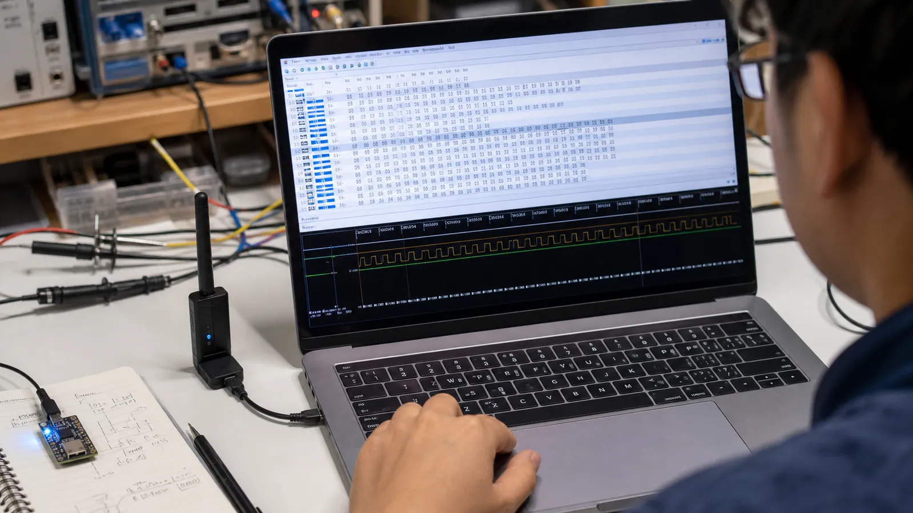

# ساختار پکت BLE و تحلیل بایت‌به‌بایت بسته‌ها

اجزای Preamble، Access Address، Header، Payload و CRC را یاد بگیرید و یک بسته BLE را قدم‌به‌قدم از روی بایت‌ها تحلیل کنید.

- دسته‌بندی: آموزش جامع BLE
- آخرین بروزرسانی: 2026-07-15T07:39:43.733033
- نسخه اصلی در سایت: [https://lcenj.ir/learning/5/ble-packet-structure-byte-analysis](https://lcenj.ir/learning/5/ble-packet-structure-byte-analysis)

## متن مقاله

مرحله 3 از ۲۰ مسیر تسلط بر BLE

دیدن رشته‌ای از بایت‌ها در Sniffer ابتدا ترسناک است. با شکستن پکت به چند بخش ثابت و سپس تفسیر Header و Payload، همان داده خام به یک پیام قابل فهم تبدیل می‌شود. این مهارت پایه دیباگ همه مراحل بعدی است.

در پایان این مقاله چه یاد می‌گیرید؟- BLE packet

- ساختار پکت BLE

- Access Address

- CRC BLE

قاب کلی پکت

پکت روی هوا با Preamble آغاز می‌شود تا گیرنده زمان‌بندی بیت را هماهنگ کند. Access Address مشخص می‌کند بسته متعلق به Advertising اولیه یا یک اتصال خاص است. پس از آن PDU شامل Header و Payload می‌آید و CRC خطاهای انتقال را آشکار می‌کند. طول دقیق بعضی بخش‌ها به PHY و نوع PDU وابسته است.

Header چه می‌گوید؟

در کانال Advertising، بیت‌های Header نوع PDU، اطلاعات آدرس و طول Payload را مشخص می‌کنند. در کانال داده، Header موضوعاتی مانند شناسه کانال منطقی، شماره توالی و وجود داده بیشتر را حمل می‌کند. همیشه نوع کانال و نوع PDU را قبل از معنی‌کردن بایت‌های بعدی مشخص کنید.

تحلیل Payload

Payload ممکن است آدرس فرستنده، ساختارهای AD، داده ATT یا کنترل Link Layer باشد. ترتیب بایت در بسیاری از فیلدهای چندبایتی Little Endian است؛ یعنی کم‌ارزش‌ترین بایت زودتر دیده می‌شود. Sniffer خوب فیلدها را باز می‌کند، اما توانایی بررسی دستی برای کشف خطای طول، اندین‌بودن یا UUID ضروری است.

زمان‌بندی و IFS

در تبادل متصل، بسته‌های دو طرف با فاصله کوتاه ثابت Inter Frame Space از هم جدا می‌شوند و شماره توالی جلوی تحویل تکراری داده را می‌گیرد. اگر پاسخ به‌موقع نرسد، ارسال در Connection Event بعدی تکرار می‌شود. نمودار زمان به شما می‌گوید مشکل از داده است یا از زمان‌بندی رادیو.

مثال ساده تحلیل بایت

در یک Advertising ابتدا نوع PDU و Length را از Header بخوانید. سپس آدرس 6 بایتی را جدا کنید. باقی Payload را به بلوک‌های «Length، Type، Data» بشکنید. مثلاً Type برابر 0x09 نام کامل محلی و Type برابر 0xFF داده سازنده را نشان می‌دهد.

چک‌لیست یادگیری

- مفهوم را با زبان خودتان توضیح دهید.

- مثال مقاله را روی کاغذ یا برد واقعی تکرار کنید.

- نتیجه، خطا و سؤال خود را یادداشت کنید.

- پس از اطمینان، به مرحله بعد بروید.

ادامه مسیر BLE

مرحله 2: لایه فیزیکی BLE: فرکانس، کانال‌ها، PHY و پرش فرکانسیمرحله 4: Advertising در BLE: انواع تبلیغ، Beacon و ساخت داده Advertising

منابع رسمی برای مطالعه بیشتر

- راهنمای رسمی Bluetooth LE

- Bluetooth Core Specification

- راهنمای رسمی Wireshark

## فایل‌ها

نسخه HTML، CSS، تصاویر، رسانه‌ها و بسته اصلی مقاله در همین پوشه قرار گرفته‌اند.
