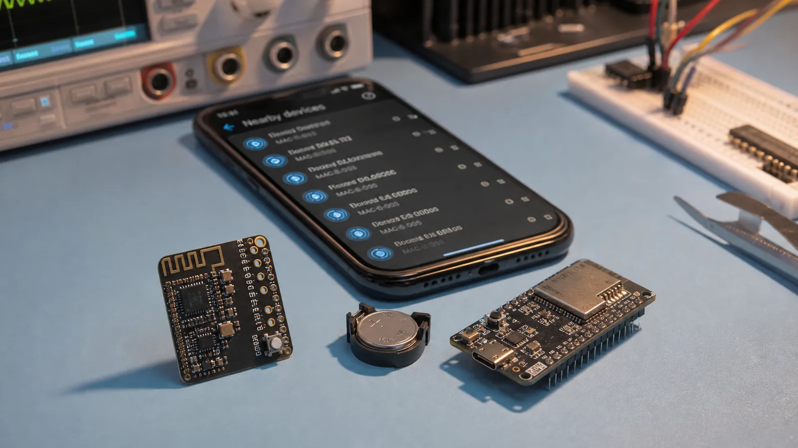

# Advertising در BLE: انواع تبلیغ، Beacon و ساخت داده Advertising

دستگاه BLE چگونه دیده می‌شود؟ انواع Advertising، Scan Response، Beacon و ساخت Flags، Local Name، UUID و Manufacturer Data را بیاموزید.

- دسته‌بندی: آموزش جامع BLE
- آخرین بروزرسانی: 2026-07-18T04:37:59.859490
- نسخه اصلی در سایت: [https://lcenj.ir/learning/6/ble-advertising-beacon-packet](https://lcenj.ir/learning/6/ble-advertising-beacon-packet)

## متن مقاله

مرحله 4 از ۲۰ مسیر تسلط بر BLE

قبل از اتصال، دستگاه باید حضور و قابلیت خود را اعلام کند. Advertising می‌تواند فقط یک پیام کوتاه پخش کند، اجازه اسکن بدهد یا راه اتصال را باز کند. طراحی درست این داده روی کشف‌پذیری، مصرف باتری و تجربه موبایل اثر مستقیم دارد.

در پایان این مقاله چه یاد می‌گیرید؟- BLE Advertising

- ساخت Beacon

- Advertising Packet

- Manufacturer Data

Advertising چه کاری انجام می‌دهد؟

Advertiser در فاصله‌های مشخص روی کانال‌های تبلیغ پیام می‌فرستد. Scanner این پیام‌ها را می‌شنود و بر اساس آدرس، نام، UUID سرویس یا داده سازنده تصمیم می‌گیرد. کوتاه‌کردن Interval کشف را سریع‌تر می‌کند اما مصرف و ازدحام را بالا می‌برد.

انواع اصلی

Connectable Undirected برای بیشتر محصولاتی است که باید توسط هر Central پیدا و متصل شوند. Directed برای اتصال سریع به دستگاه مشخص به کار می‌رود. Scannable اجازه دریافت Scan Response می‌دهد و Non-Connectable فقط داده پخش می‌کند. Extended Advertising فضای بیشتر و PHYهای متنوع‌تری می‌دهد، مشروط به پشتیبانی دو طرف.

Scan Response و Beacon

اگر داده در بسته اصلی جا نشود، Scanner می‌تواند Scan Request بفرستد و دستگاه با Scan Response اطلاعات تکمیلی مثل نام کامل پاسخ دهد. Beacon معمولاً بدون اتصال داده شناسه یا تله‌متری را پخش می‌کند. قالب‌های iBeacon، Eddystone و AltBeacon قراردادهای متفاوتی برای چیدمان این داده هستند.

ساخت AD Structure

هر بخش Advertising با یک بایت Length، سپس Type و Data ساخته می‌شود. Flags وضعیت عمومی را می‌گوید؛ Local Name برای نمایش انسانی است؛ UUID سرویس به برنامه اجازه فیلتر می‌دهد؛ Service Data و Manufacturer Data داده اختصاصی را حمل می‌کنند. قبل از ارسال، مجموع طول و اندین‌بودن عددها را کنترل کنید.

نمونه داده دماسنج

برای دماسنج، Flags را در بسته اصلی بگذارید، UUID سرویس محیطی را اضافه کنید و نام کوتاه را در فضای باقی‌مانده قرار دهید. اگر لازم است مدل و نسخه Firmware دیده شود، آن را به Scan Response منتقل کنید. داده حساس را هرگز بدون طراحی امنیتی در Advertising نفرستید.

چک‌لیست یادگیری

- مفهوم را با زبان خودتان توضیح دهید.

- مثال مقاله را روی کاغذ یا برد واقعی تکرار کنید.

- نتیجه، خطا و سؤال خود را یادداشت کنید.

- پس از اطمینان، به مرحله بعد بروید.

ادامه مسیر BLE

مرحله 3: ساختار پکت BLE و تحلیل بایت‌به‌بایت بسته‌هامرحله 5: نقش‌های BLE در GAP: Peripheral، Central، Broadcaster و Observer

منابع رسمی برای مطالعه بیشتر

- راهنمای رسمی Bluetooth LE

- Bluetooth Core Specification

- مستندات رسمی BLE در ESP-IDF

## فایل‌ها

نسخه HTML، CSS، تصاویر، رسانه‌ها و بسته اصلی مقاله در همین پوشه قرار گرفته‌اند.
