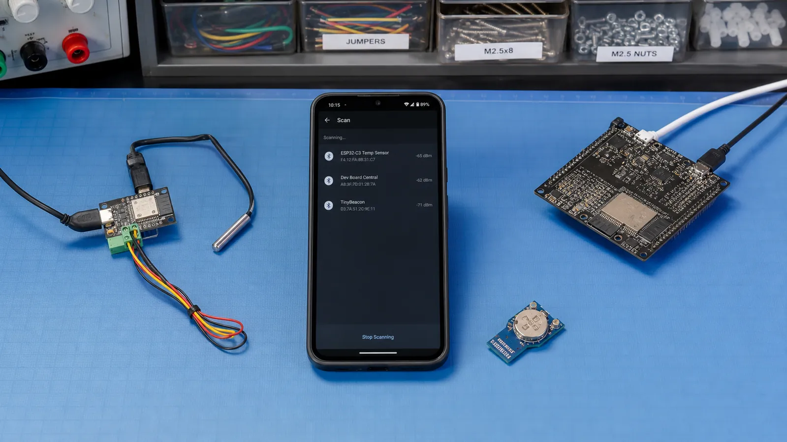

# نقش‌های BLE در GAP: Peripheral، Central، Broadcaster و Observer

چه کسی تبلیغ می‌کند، چه کسی اسکن می‌کند و نقش Central و Peripheral در سناریوهای گوشی، سنسور، دو ESP32 و Beacon چیست؟

- دسته‌بندی: آموزش جامع BLE
- آخرین بروزرسانی: 2026-07-15T07:39:42.236879
- نسخه اصلی در سایت: [https://lcenj.ir/learning/7/ble-gap-roles-central-peripheral](https://lcenj.ir/learning/7/ble-gap-roles-central-peripheral)

## متن مقاله

مرحله 5 از ۲۰ مسیر تسلط بر BLE

واژه‌های Central و Peripheral درباره نقش ارتباط هستند، نه قدرت سخت‌افزار. گوشی معمولاً Central و سنسور Peripheral است، اما همان ESP32 می‌تواند در پروژه‌ای دیگر نقش Central بگیرد. با شناخت نقش‌ها، مسیر API و مسئولیت هر طرف روشن می‌شود.

در پایان این مقاله چه یاد می‌گیرید؟- BLE Central Peripheral

- GAP Roles

- نقش های BLE

- ESP32 BLE Central

Peripheral و Central

Peripheral معمولاً Advertising می‌کند و داده یا سرویس را ارائه می‌دهد. Central اسکن می‌کند، دستگاه مناسب را پیدا می‌کند و اتصال را آغاز می‌کند. پس از اتصال، نقش Link Layer با نقش GATT Client و Server یکی نیست؛ غالباً Central کلاینت است اما این الزام مطلق نیست.

Broadcaster و Observer

Broadcaster داده را بدون نیاز به اتصال پخش می‌کند؛ Beacon نمونه رایج آن است. Observer فقط Advertising را دریافت و تحلیل می‌کند و لزوماً اتصال نمی‌سازد. این دو نقش برای تله‌متری ساده، حضورسنجی و اسکن محیط کم‌هزینه‌اند.

گوشی و سنسور

در یک دماسنج، سنسور Advertising می‌کند، گوشی آن را اسکن و متصل می‌شود، سپس سرویس‌ها را کشف می‌کند. اگر گوشی Notify را فعال کند، سنسور با تغییر دما مقدار جدید می‌فرستد. مسئول شروع اتصال گوشی است ولی داده کاربردی را سنسور تولید می‌کند.

دو ESP32 و چند نقش

یک ESP32-C3 می‌تواند Peripheral باشد و داده SHT31 را ارائه کند؛ ESP32 دوم Central باشد و آن را روی نمایشگر نشان دهد. برخی تراشه‌ها چند اتصال یا چند نقش هم‌زمان را پشتیبانی می‌کنند، اما RAM، زمان رادیو و پیچیدگی مدیریت وضعیت افزایش می‌یابد.

تمرین تعیین نقش

برای سه سناریوی «Beacon فروشگاه»، «قفل هوشمند با موبایل» و «Gateway که ده سنسور را می‌خواند» نقش هر دستگاه را بنویسید. سپس جداگانه مشخص کنید کدام طرف GATT Server و کدام طرف GATT Client است.

چک‌لیست یادگیری

- مفهوم را با زبان خودتان توضیح دهید.

- مثال مقاله را روی کاغذ یا برد واقعی تکرار کنید.

- نتیجه، خطا و سؤال خود را یادداشت کنید.

- پس از اطمینان، به مرحله بعد بروید.

ادامه مسیر BLE

مرحله 4: Advertising در BLE: انواع تبلیغ، Beacon و ساخت داده Advertisingمرحله 6: اتصال در BLE: مراحل Connect، پارامترهای اتصال و مصرف انرژی

منابع رسمی برای مطالعه بیشتر

- راهنمای رسمی Bluetooth LE

- مستندات رسمی BLE در ESP-IDF

## فایل‌ها

نسخه HTML، CSS، تصاویر، رسانه‌ها و بسته اصلی مقاله در همین پوشه قرار گرفته‌اند.
