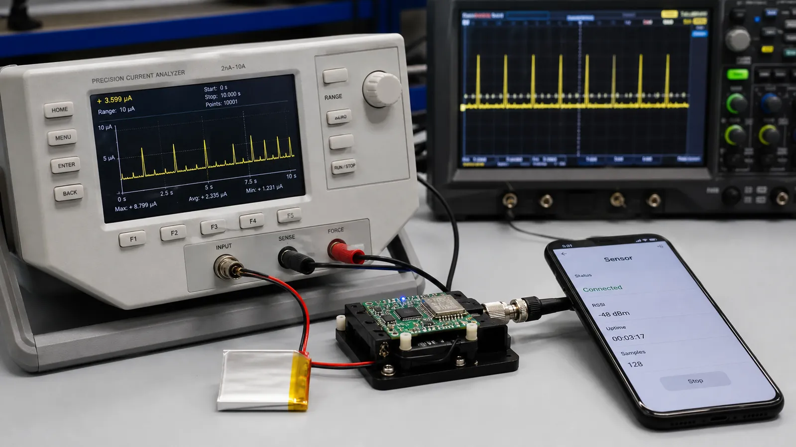

# اتصال در BLE: مراحل Connect، پارامترهای اتصال و مصرف انرژی

از Advertising تا Connection Established پیش بروید و اثر Connection Interval، Peripheral Latency و Supervision Timeout را بر سرعت و باتری بفهمید.

- دسته‌بندی: آموزش جامع BLE
- آخرین بروزرسانی: 2026-07-15T07:39:42.543703
- نسخه اصلی در سایت: [https://lcenj.ir/learning/8/ble-connection-parameters-power](https://lcenj.ir/learning/8/ble-connection-parameters-power)

## متن مقاله

مرحله 6 از ۲۰ مسیر تسلط بر BLE

اتصال BLE یک جریان دائمی از داده نیست؛ مجموعه‌ای از قرارهای زمانی کوتاه میان Central و Peripheral است. تنظیم درست این قرارها تفاوت میان محصول پاسخ‌گو و محصولی با باتری ضعیف را رقم می‌زند.

در پایان این مقاله چه یاد می‌گیرید؟- BLE connection interval

- BLE latency

- supervision timeout

- مصرف انرژی BLE

مسیر برقراری اتصال

Peripheral تبلیغ Connectable می‌فرستد، Central آن را در Scan می‌بیند و درخواست اتصال را با پارامترهای اولیه ارسال می‌کند. هر دو طرف سپس در زمان و کانال توافق‌شده وارد نخستین Connection Event می‌شوند. اگر زمان‌بندی یا Access Address درست نباشد، اتصال عملاً شکل نمی‌گیرد.

Connection Interval

Interval فاصله شروع دو Connection Event متوالی است. فاصله کوتاه پاسخ سریع‌تر و فرصت ارسال بیشتر می‌دهد، اما رادیو زودتر بیدار می‌شود. فاصله بلند مصرف متوسط را کم می‌کند ولی تأخیر فرمان و Notify افزایش می‌یابد. مقدار مناسب باید از نیاز کاربرد استخراج و روی سخت‌افزار اندازه‌گیری شود.

Peripheral Latency و Timeout

Peripheral Latency اجازه می‌دهد دستگاه جانبی در صورت نداشتن داده چند Event را رد کند. Supervision Timeout حداکثر سکوت قابل قبول پیش از اعلام قطع اتصال است. Timeout باید با Interval و Latency سازگار باشد؛ مقدار بسیار کوچک قطع‌های کاذب و مقدار بسیار بزرگ تشخیص دیرهنگام خرابی ایجاد می‌کند.

Connection Event و مصرف

در هر Event دو رادیو روی کانال مشخص بیدار می‌شوند، بسته ردوبدل می‌کنند و دوباره می‌خوابند. تعداد بسته، زمان روی هوا، PHY و Retransmission انرژی را تعیین می‌کنند. اسیلوسکوپ یا Power Profiler پالس‌های جریان را نشان می‌دهد و بهترین ابزار برای مقایسه تنظیمات است.

تنظیم شروع برای سنسور

برای دماسنجی که هر ثانیه به‌روزرسانی می‌شود، از Interval میانه شروع کنید، Latency را کم بگذارید و Timeout چند برابر بزرگ‌تر انتخاب کنید. سپس فرمان کاربر، نرخ Notify و جریان متوسط را اندازه بگیرید. برای محصول واقعی عدد نهایی را با تست در حضور Wi-Fi انتخاب کنید.

چک‌لیست یادگیری

- مفهوم را با زبان خودتان توضیح دهید.

- مثال مقاله را روی کاغذ یا برد واقعی تکرار کنید.

- نتیجه، خطا و سؤال خود را یادداشت کنید.

- پس از اطمینان، به مرحله بعد بروید.

ادامه مسیر BLE

مرحله 5: نقش‌های BLE در GAP: Peripheral، Central، Broadcaster و Observerمرحله 7: معماری پروتکل BLE: از PHY و Link Layer تا L2CAP، ATT و GATT

منابع رسمی برای مطالعه بیشتر

- راهنمای رسمی Bluetooth LE

- Bluetooth Core Specification

- مستندات رسمی BLE در ESP-IDF

## فایل‌ها

نسخه HTML، CSS، تصاویر، رسانه‌ها و بسته اصلی مقاله در همین پوشه قرار گرفته‌اند.
