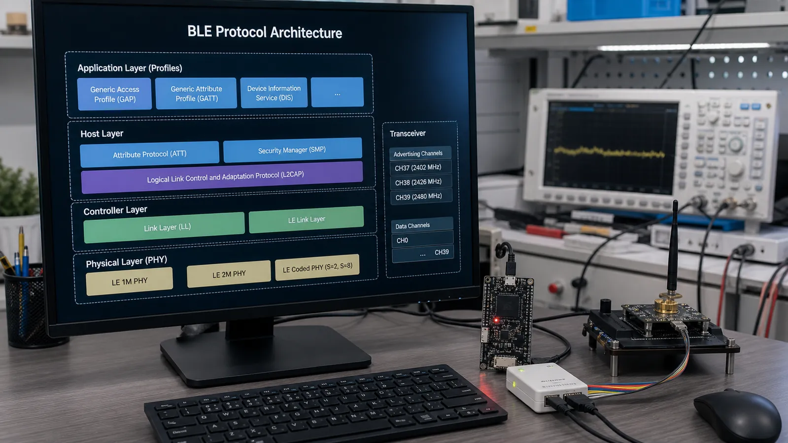

# معماری پروتکل BLE: از PHY و Link Layer تا L2CAP، ATT و GATT

لایه‌های BLE و مسیر عبور یک داده از اپلیکیشن تا آنتن را به زبان ساده دنبال کنید و وظیفه GAP، GATT، ATT، L2CAP و SMP را بشناسید.

- دسته‌بندی: آموزش جامع BLE
- آخرین بروزرسانی: 2026-07-26T06:10:02.827145
- نسخه اصلی در سایت: [https://lcenj.ir/learning/9/ble-protocol-stack-architecture](https://lcenj.ir/learning/9/ble-protocol-stack-architecture)

## متن مقاله

مرحله 7 از ۲۰ مسیر تسلط بر BLE

پشته BLE را می‌توان مانند یک اداره چندطبقه دید: هر طبقه مسئله مشخصی را حل می‌کند و داده را با قرارداد روشن به طبقه پایین‌تر می‌دهد. این مدل هنگام خطایابی مشخص می‌کند باید سراغ رادیو، اتصال، Attribute یا منطق برنامه بروید.

در پایان این مقاله چه یاد می‌گیرید؟- BLE stack

- معماری BLE

- L2CAP ATT GATT

- GAP SMP

Controller: PHY و Link Layer

PHY بیت را به موج و موج را به بیت تبدیل می‌کند. Link Layer کانال، زمان‌بندی، Advertising، اتصال، شماره توالی، کنترل خطا و رمزنگاری سطح لینک را مدیریت می‌کند. این بخش معمولاً داخل کنترلر رادیویی و Firmware سازنده اجرا می‌شود.

HCI و مرز Host

در بعضی تراشه‌ها Host و Controller روی یک چیپ‌اند و در برخی محصولات جدا هستند. HCI فرمان‌ها، رخدادها و داده را بین این دو جابه‌جا می‌کند. مشاهده خطای HCI معمولاً یعنی درخواست Host توسط Controller رد شده یا رخدادی درباره وضعیت رادیو رسیده است.

L2CAP، ATT و SMP

L2CAP داده پروتکل‌های بالاتر را روی لینک منطقی حمل و در صورت نیاز قطعه‌قطعه و دوباره جمع می‌کند. ATT جدول Attribute و عملیات Read و Write را تعریف می‌کند. SMP مسئول Pairing، تولید کلید و بخشی از فرایند امنیت است.

GATT و GAP

GATT روی ATT مدل Service، Characteristic و Descriptor و روش استفاده از آن‌ها را تعریف می‌کند. GAP کشف دستگاه، Advertising، نقش‌ها، حالت اتصال و سطح‌های امنیتی را سامان می‌دهد. اپلیکیشن معمولاً با APIهای GAP و GATT کار می‌کند، اما رفتار واقعی به همه لایه‌ها وابسته است.

مسیر یک دمای Notify

برنامه مقدار دما را در Characteristic می‌گذارد. GATT عملیات Notify را انتخاب می‌کند، ATT یک Handle Value Notification می‌سازد، L2CAP آن را حمل می‌کند، Link Layer بسته و زمان ارسال را تعیین می‌کند و PHY بیت‌ها را روی 2.4 گیگاهرتز می‌فرستد. در گیرنده همین مسیر برعکس طی می‌شود.

چک‌لیست یادگیری

- مفهوم را با زبان خودتان توضیح دهید.

- مثال مقاله را روی کاغذ یا برد واقعی تکرار کنید.

- نتیجه، خطا و سؤال خود را یادداشت کنید.

- پس از اطمینان، به مرحله بعد بروید.

ادامه مسیر BLE

مرحله 6: اتصال در BLE: مراحل Connect، پارامترهای اتصال و مصرف انرژیمرحله 8: پروتکل ATT در BLE: Attribute، Handle، Read، Write و MTU

منابع رسمی برای مطالعه بیشتر

- راهنمای رسمی Bluetooth LE

- Bluetooth Core Specification

- مستندات رسمی BLE در ESP-IDF

## فایل‌ها

نسخه HTML، CSS، تصاویر، رسانه‌ها و بسته اصلی مقاله در همین پوشه قرار گرفته‌اند.
