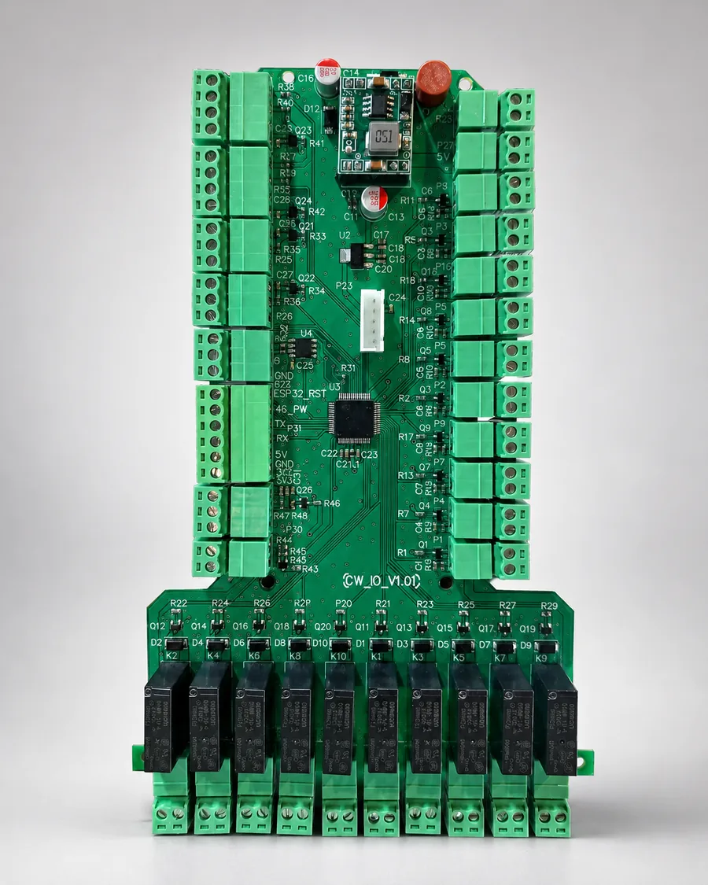
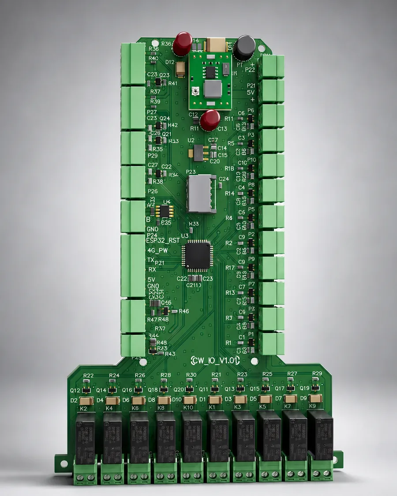

# Smart Car Wash Controller Board

An industrial controller board designed for smart car wash automation. The controller is built around an STM32 microcontroller and provides multiple digital inputs and outputs for monitoring and controlling field equipment.

## Key Features

- STM32-based embedded controller
- Multiple isolated control inputs and relay outputs
- UART communication support
- RS-485 communication for robust industrial networking
- Temperature and humidity monitoring
- Expandable architecture for pumps, valves, sensors, alarms, and auxiliary equipment
- Designed for reliable operation in an industrial automation environment

## Project Scope

The project covers controller architecture, schematic and PCB design, component selection, embedded firmware integration, communication interfaces, and environmental monitoring. Public materials intentionally exclude proprietary source code, schematics, Gerber files, and production data.

## Gallery

## درباره پروژه

این برد برای کنترل مرکزی یک کارواش هوشمند طراحی شده است. پردازنده STM32، ورودی‌ها و خروجی‌های متعدد، ارتباط UART و RS-485 و سامانه سنجش دما و رطوبت، امکان کنترل تجهیزات و پایش شرایط محیطی را در یک بستر صنعتی فراهم می‌کنند.

## Links

- Website: [LCENJ](https://lcenj.ir)
- Portfolio: [Mohammad Norouzian Azizi](https://lcenj.ir/about#portfolio)

## Keywords

`STM32` `UART` `RS-485` `Industrial Automation` `PCB Design` `Embedded Systems` `Smart Car Wash` `Temperature and Humidity Monitoring`
